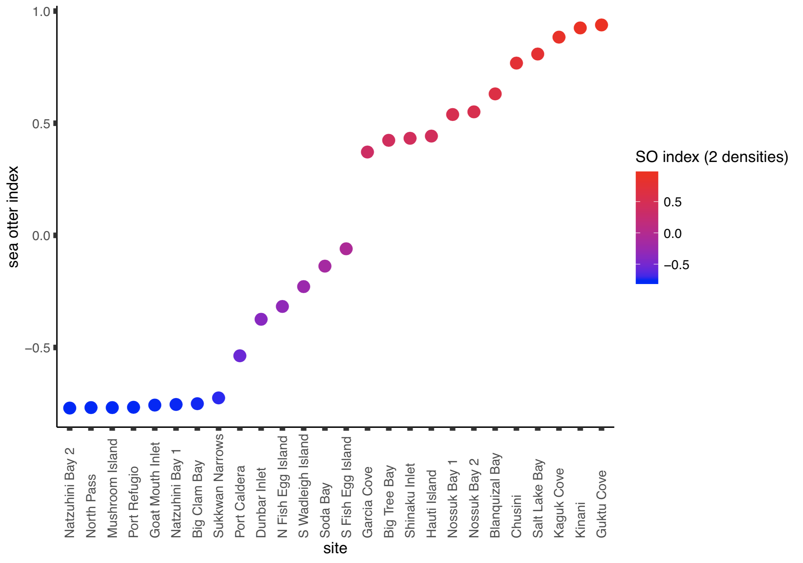

```{r setup, include=FALSE}
knitr::opts_chunk$set(echo = FALSE, warning = FALSE, message = FALSE)

#theme_set(theme_classic())
#theme_set(theme_cowplot(font_size=12))
```

```{r}
library(leaflet)
library(htmlwidgets)
library(htmltools)
library(reshape)
library(reshape2)
library(dplyr)
library(plyr)
library(tidyr)
library(ggplot2)
library(plotly)
library(lubridate)
library(DT)
library(shiny)
library(mapview)
library(sp)
library(sf)
library(knitr)
library(cowplot)
library(ggpmisc)
library(DT)
library(magick)
library(mgcv)
```

<br><br>

--- 

When foraging for clams, sea otters cause physical disturbance to marine sediments. Some of their preferred prey (e.g. butter and steamer clams) live intertidally, alongside the seagrass beds that fringe the Alaskan shorelines. It was recorded during the 2017 field season that the number of pits dug outside and at the edge of seagrass beds often exceeded the number within the same bed. Seagrass biomass is actively removed with such bioturbation and it was questioned whether increased digging activity at the bed's edge reduces seagrass extent in the intertidal. 

This was investigated observationally and experimentally:
[*Observational*] The elevation of the upper edges (diffuse and continuous) was measured across a sea otter gradient, the hypothesis being that the upper extent of seagrass beds will be lower in elevation in areas with higher sea otter presence compared to seagrass beds minimally influenced by sea otters. The upper and lower extent of the *Fucus* band was also measured to assess potential differences in elevation due to exposure. In addition to elevation data, the width of the diffuse seagrass bed was measured, as well as seagrass density of the diffuse edge, continuous edge, and inside the bed.
[*Experimental*] Cages and control plots (n = 3; ~ 1.05 x 1.60 m) were installed along the edge of a seagrass bed at 10 sites located in regions with elevated sea otter presence. Half of the plots consisted of existing vegetation and the other half bare sediment above the bed. These plots will help determine if the upper edge of the seagrass bed is capable of extending higher into the intertidal if protected from sea otter digging activity. The control plots will also be used to estimate the rate of pits dug and the area disturbed. 

<br>

**For the Analysis, we need the following information:**

* Elevation data for seagrass edges and *Fucus* band
* Accurate tidal data, with corrections for amplitude and time based on proximity to nearest NOAA buoy
* Sea otter index data
    + Re-occupation time for each site
    + Tinker population density model values
    + Sea otter densities via boat-based field surveys, duplicated
    + Total pits at each site
    + Proportion of shells broken by sea otters
* Seagrass density at the diffuse edge, continuous edge, and inside the bed    
* Seagrass biomass (per area) inside the bed, above- and belowground
* Seagrass density and % area data for cages and controls
* Pit density and % area data for cages and controls

<br><br>

---

> ###**An introduction to the sites and site data**

We measured elevations at 26 sites across POW, and installed cages at 10 sites from Naukati to Klawock.

<br>

\SiteMapping
```{r, fig.align = 'center'}
# import sites as .csv file
sites.map <- read.csv("/Users/tiff/Desktop/R Studio/APECS-master-repos/ALL_DATA/TIFF_seagrass/2018_data_efforts/sites_map.csv", stringsAsFactors = FALSE, header = TRUE)


# generate maps for observational and experimental sites

map1 <- leaflet(sites.map) %>% addTiles() %>% 
  addCircleMarkers(
    lng = ~longitude_26, lat = ~latitude_26,
    radius = ~3,
    stroke = FALSE, fillOpacity = 0.5, 
    color = ~'Red',
    label = as.character(sites.map$site)
  )


map2 <- leaflet(sites.map) %>% addTiles() %>% 
  addCircleMarkers(
    lng = ~longitude_10, lat = ~latitude_10,
    radius = ~3,
    stroke = FALSE, fillOpacity = 0.5, 
    color = ~'Blue',
    label = as.character(sites.map$site)
  )


tagList(
  tags$head(tags$script(
    type="text/javascript",
    src="https://cdn.rawgit.com/turban/Leaflet.Sync/master/L.Map.Sync.js"
  )),
  tags$div(style="display:inline;width:33%;float:left;",map1),
  tags$div(style="display:inline;width:33%;float:left;",map2),
  onStaticRenderComplete(
    '
var leaf_widgets = Array.prototype.map.call(
  document.querySelectorAll(".leaflet"),
  function(ldiv){
    return HTMLWidgets.find("#" + ldiv.id);
  }
);

// make this easy since we know only two maps
leaf_widgets[0].sync(leaf_widgets[1]);
leaf_widgets[1].sync(leaf_widgets[0]);
'
  )
) %>%
  browsable
```

```{r}
rm(sites.map)
```

<br><br><br><br><br><br><br><br><br><br><br><br><br><br><br><br><br><br><br><br><br><br>


**Great.** Now that we know where we are working, let's compile a comprehensive dataframe of site characteristics. The following shows all of the site-level variables that we have and that could be considered when investigating relationships with the upper extent of seagrass. All of these variables were collected/calculated in the same way as they were for the 2017 season. 

*After a flurry of code...*


\BeachSlope
```{r}
slopes <- read.csv("/Users/tiff/Desktop/R Studio/APECS-master-repos/ALL_DATA/TIFF_seagrass/2018_data_efforts/elevs_worked.csv", stringsAsFactors = FALSE, header = TRUE)

slopes <- slopes[, -c(2:10, 12:18)] # remove these columns

slopes <- aggregate(beach_slope ~ site, data = slopes, mean, na.rm = TRUE) # calculate mean slope per site
```


\OtterMetrics
```{r}
index <- read.csv("/Users/tiff/Desktop/R Studio/APECS-master-repos/sea_otter_index_2018/so_index_dens2_stephens.csv", stringsAsFactors = FALSE, header = TRUE)

index <- index %>%
  mutate(dens_otter_avg = (dens_otter1 + dens_otter2) / 2)

index <- index[, -c(2:6, 12)] # remove these columns
```


\SedimentQualitative
```{r}
# import pits and sediment quality data as .csv file
df.seds <- read.csv("/Users/tiff/Desktop/R Studio/APECS-master-repos/sea_otter_index_2018/pits_trimmed.csv", stringsAsFactors = FALSE, header = TRUE)


# summarise mean sediment quality within site, transects stacked in one column
df.1 <- aggregate(sed1 ~ site + trans_loc, data = df.seds, mean, na.rm = TRUE)
df.2 <- aggregate(sed2 ~ site + trans_loc, data = df.seds, mean, na.rm = TRUE)
df.seds.stack <- left_join(df.1, df.2, by = c("site", "trans_loc")) # join both seds together


# summarise sediment quality with transects in independent columns
df.1 <- spread(df.1, key = trans_loc, value = sed1) # split into three columns
colnames(df.1)[2] <- "sed1_edge" # change column names
colnames(df.1)[3] <- "sed1_inside" # change column names
colnames(df.1)[4] <- "sed1_outside" # change column names

df.2 <- spread(df.2, key = trans_loc, value = sed2) # split into three columns
colnames(df.2)[2] <- "sed2_edge" # change column names
colnames(df.2)[3] <- "sed2_inside" # change column names
colnames(df.2)[4] <- "sed2_outside" # change column names

df.seds.trans <- left_join(df.1, df.2, by = c("site")) # join both seds together


# get means for site
df.seds.trans <- df.seds.trans %>%
  mutate(sed1_site_avg = (sed1_edge + sed1_inside + sed1_outside) / 3) %>%
  mutate(sed2_site_avg = (sed2_edge + sed2_inside + sed2_outside) / 3) %>%
  mutate(sedall_site_avg = (sed1_edge + sed1_inside + sed1_outside + sed2_edge + sed2_inside + sed2_outside) / 6) %>%
  mutate(sed1_abovegrass = (sed1_edge + sed1_outside) / 2) %>%
  mutate(sed2_abovegrass = (sed2_edge + sed2_outside) / 2)


# join other sed + site data
sites.2018 <- read.csv("/Users/tiff/Desktop/R Studio/APECS-master-repos/ALL_DATA/TIFF_seagrass/2018_data_efforts/sites_2018.csv", stringsAsFactors = FALSE, header = TRUE) # import site data

df.seds.trans <- left_join(sites.2018, df.seds.trans, by = c("site")) # join both seds together
```

```{r}
rm(df.1)
rm(df.2)
rm(df.seds)
```


\PitsExtended
```{r}
# import pits and sediment quality data as .csv file
df.pits <- read.csv("/Users/tiff/Desktop/R Studio/APECS-master-repos/sea_otter_index_2018/pits_trimmed.csv", stringsAsFactors = FALSE, header = TRUE)


# summarise mean sediment quality within site, transects stacked in one column
df.pits.stack <- aggregate(n_pits ~ site + trans_loc, data = df.pits, sum, na.rm = TRUE)


# summarise sediment quality with transects in independent columns
library(reshape)
df.pits.trans <- spread(df.pits.stack, key = trans_loc, value = n_pits) # split into three columns
colnames(df.pits.trans)[2] <- "pits_edge" # change column names
colnames(df.pits.trans)[3] <- "pits_inside" # change column names
colnames(df.pits.trans)[4] <- "pits_outside" # change column names


# get means for site
df.pits.trans <- df.pits.trans %>%
  mutate(pits_site_sum = pits_edge + pits_inside + pits_outside) %>%
  mutate(pits_abovegrass = pits_edge + pits_outside)
```

```{r}
rm(df.pits)
```


\JoinSiteData
```{r}
# join site data by site, only
df.site <- left_join(df.seds.trans, slopes, by = c("site")) # join 
df.site <- left_join(df.site, index, by = c("site")) # join 
df.site <- left_join(df.site, df.pits.trans, by = c("site")) # join 

colnames(df.site)[6] <- "sed1_qual" # change column names
colnames(df.site)[7] <- "sed2_qual" # change column names
colnames(df.site)[29] <- "so_index" # change column names


# join site data by transect location and site
df.stacked <- left_join(df.seds.stack, df.pits.stack, by = c("site", "trans_loc")) # join 
df.stacked <- left_join(df.stacked, df.site, by = c("site")) # join 

df.stacked <- df.stacked[, -c(11:21, 31:35)] # remove these columns
```

```{r}
rm(df.seds.stack)
rm(df.pits.stack)
rm(df.seds.trans)
rm(df.pits.trans)
rm(index)
rm(sites.2018)
rm(slopes)
```

```{r}
# organize 
df.site <- df.site[c("site","longitude","latitude","date_grass_MM.DD.YY","date_otts1_MM.DD.YY","date_otts2_MM.DD.YY","so_region1","so_region2","beach_slope","site_polygon_area_km2","so_index","so_duration","pop_dens_surv_km2","dens_otter1","dens_otter2","dens_otter_avg","prop_otter_shells","sed1_qual","sed2_qual","sed1_edge","sed1_inside","sed1_outside","sed2_edge","sed2_inside","sed2_outside","sed1_site_avg","sed2_site_avg","sedall_site_avg","sed1_abovegrass","sed2_abovegrass","pits_edge","pits_inside","pits_outside","pits_site_sum","pits_abovegrass")]

colnames(df.site)
```

<br><br>


##### The sea otter index:

<br>


```{r, out.width = "50%"}
knitr::include_graphics(path = "/Users/tiff/Desktop/R Studio/APECS-master-repos/ALL_DATA/TIFF_seagrass/2018_data_efforts/images/soindex2.png")
knitr::include_graphics(path = "/Users/tiff/Desktop/R Studio/APECS-master-repos/ALL_DATA/TIFF_seagrass/2018_data_efforts/images/soindexavg.png")


#
```

<br>

The index on the left uses identical input values as the index from last year, where the boat-based sea otter counts were included as two seperate input variables. The index on the right uses the means of these two sea otter surveys per site. Franz Mueter recommended that the two surveys be included, seperately. Interpretting the graphs with such recommendation in mind, I do find the larger jump between "S Fish Egg Island" and "Garcia Cove" appropriate after working in the collective sites for the past 1-2 years. As such, I will proceed with the index on the left but wanted to present both options to the group, here. 


<br><br><br><br><br>


---

> ###**Determining elevations to assess upper extent of seagrass** 
*...and inclusion of seagrass density*

<br><br>

First, here is a schematic of what elevation data we collected in the field (along a 50-m transect): 


```{r, out.width = "75%", fig.align = "center"}
knitr::include_graphics(path = "/Users/tiff/Desktop/R Studio/APECS-master-repos/ALL_DATA/TIFF_seagrass/2018_data_efforts/images/intertidal_measurements_a.png")

#
```


<br><br>

The true elevation of the seagrass and *Fucus* measurements were derived from knowing the elevation of the waterline at a specific time. For determining the elevation of the waterline, it is tempting to rely tidal elevation provided by a nearby tidal station -- this is fine for some sites due to their close proximity, but for others, the true waterline elevation will diverge from such measurements due to spatiotemporal influences on water movement. I corrected for this by reaching out to someone connected to the US Coast Guard and NOAA branches responsible for assessing the accuracy of marine benthic maps used for navigation. They re-surveyed a good chunk of POW in 2008, and their work required applying spatiotemporal corrections for tidal amplitude in subregions across POW (example shown below). Lucky us! 

<br>

```{r, out.width = "70%", fig.align = "center"}
knitr::include_graphics(path = "/Users/tiff/Desktop/R Studio/APECS-master-repos/ALL_DATA/TIFF_seagrass/2018_data_efforts/images/tidalcorrection.png")

#
```

<br><br>


\Elevations
```{r}
df.elev <- read.csv("/Users/tiff/Desktop/R Studio/APECS-master-repos/ALL_DATA/TIFF_seagrass/2018_data_efforts/elevs_worked.csv", stringsAsFactors = FALSE, header = TRUE)

df.elev <- df.elev[, -c(2)] # remove these columns

df.1 <- aggregate(distance_diffuse_band_cm ~ site, data = df.elev, mean, na.rm = TRUE)
df.2 <- aggregate(fucus_upper_elev_mllw_cm ~ site, data = df.elev, mean, na.rm = TRUE)
df.3 <- aggregate(fucus_lower_elev_mllw_cm ~ site, data = df.elev, mean, na.rm = TRUE)
df.4 <- aggregate(fucus_mean_elev_mllw_cm ~ site, data = df.elev, mean, na.rm = TRUE)
df.5 <- aggregate(fucus_band_height_cm ~ site, data = df.elev, mean, na.rm = TRUE)
df.6 <- aggregate(edge_diffuse_elev_mllw_cm ~ site, data = df.elev, mean, na.rm = TRUE)
df.7 <- aggregate(edge_continuous_elev_mllw_cm ~ site, data = df.elev, mean, na.rm = TRUE)
df.8 <- aggregate(diffuse_band_height_cm ~ site, data = df.elev, mean, na.rm = TRUE)
df.9 <- aggregate(area_diffuse_band_m2 ~ site, data = df.elev, mean, na.rm = TRUE)

df.elev.means <- left_join(df.1, df.2, by = c("site")) # join both indices together
df.elev.means <- left_join(df.elev.means, df.3, by = c("site"))
df.elev.means <- left_join(df.elev.means, df.4, by = c("site"))
df.elev.means <- left_join(df.elev.means, df.5, by = c("site"))
df.elev.means <- left_join(df.elev.means, df.6, by = c("site"))
df.elev.means <- left_join(df.elev.means, df.7, by = c("site"))
df.elev.means <- left_join(df.elev.means, df.8, by = c("site"))
df.elev.means <- left_join(df.elev.means, df.9, by = c("site"))
```

```{r}
rm(df.1)
rm(df.2)
rm(df.3)
rm(df.4)
rm(df.5)
rm(df.6)
rm(df.7)
rm(df.8)
rm(df.9)
rm(df.elev)
```

\FucusCorrection
```{r}
# fucus correction
df.elev.means = df.elev.means %>% 
  mutate(edge_diffuse_elev_corrct_pos = edge_diffuse_elev_mllw_cm / (fucus_mean_elev_mllw_cm/169.72)) %>%
  mutate(edge_continuous_elev_corrct_pos = edge_continuous_elev_mllw_cm / (fucus_mean_elev_mllw_cm/169.72)) %>%
  mutate(edge_diffuse_elev_corrct_neg = edge_diffuse_elev_mllw_cm * (fucus_mean_elev_mllw_cm/169.72)) %>%
  mutate(edge_continuous_elev_corrct_neg = edge_continuous_elev_mllw_cm * (fucus_mean_elev_mllw_cm/169.72))

colnames(df.elev.means)[2] <- "diffuse_band_distance_cm" # change column names
colnames(df.elev.means)[9] <- "diffuse_band_height_cm" # change column names
colnames(df.elev.means)[10] <- "diffuse_band_area_m2" # change column names


# reorganize columns
df.elev.means <- df.elev.means[c("site","fucus_upper_elev_mllw_cm","fucus_lower_elev_mllw_cm","fucus_mean_elev_mllw_cm","fucus_band_height_cm","edge_diffuse_elev_mllw_cm","edge_continuous_elev_mllw_cm","edge_diffuse_elev_corrct_pos","edge_continuous_elev_corrct_pos","edge_diffuse_elev_corrct_neg","edge_continuous_elev_corrct_neg","diffuse_band_distance_cm","diffuse_band_height_cm","diffuse_band_area_m2")]
```


\SeagrassDensity
```{r}
df.sgdens <- read.csv("/Users/tiff/Desktop/R Studio/APECS-master-repos/ALL_DATA/TIFF_seagrass/2018_data_efforts/elevs_worked.csv", stringsAsFactors = FALSE, header = TRUE)

df.sgdens <- df.sgdens[, -c(2:12)] # remove these columns


df.10 <- aggregate(shoot_density_inside_m2 ~ site, data = df.sgdens, mean, na.rm = TRUE)
df.11 <- aggregate(shoot_density_continuous_m2 ~ site, data = df.sgdens, mean, na.rm = TRUE)
df.12 <- aggregate(shoot_density_diffuse_m2 ~ site, data = df.sgdens, mean, na.rm = TRUE)
df.13 <- aggregate(flower_density_inside_m2 ~ site, data = df.sgdens, mean, na.rm = TRUE)
df.14 <- aggregate(flower_density_continuous_m2 ~ site, data = df.sgdens, mean, na.rm = TRUE)
df.15 <- aggregate(flower_density_diffuse_m2 ~ site, data = df.sgdens, mean, na.rm = TRUE)

df.sgdens.means <- left_join(df.10, df.11, by = c("site"))
df.sgdens.means <- left_join(df.sgdens.means, df.12, by = c("site"))
df.sgdens.means <- left_join(df.sgdens.means, df.13, by = c("site"))
df.sgdens.means <- left_join(df.sgdens.means, df.14, by = c("site"))
df.sgdens.means <- left_join(df.sgdens.means, df.15, by = c("site"))
```

```{r}
rm(df.10)
rm(df.11)
rm(df.12)
rm(df.13)
rm(df.14)
rm(df.15)
rm(df.sgdens)
```


**Great.** Below is a list of elevation data available for analysis. 

*Note: The "edge_diffuse_elev_corrct" and "edge_continuous_elev_corrct" data reflect seagrass edge elevations that were corrected using Fucus elevations, potentially correcting for varation in exposure. In future analysis, I am interested in calcuating an exposure variable, based on shoreline aspect and fetch potential.*

```{r}
colnames(df.elev.means)
```

<br>

These data columns will be added to the site dataframe, as will the seagrass density data below. We have a new master dataframe! 

```{r}
colnames(df.sgdens.means)
```

<br><br><br><br><br>

---


\MERGE
\ALLDAT
```{r}
df.alldat <- left_join(df.site, df.elev.means, by = c("site"))
df.alldat <- left_join(df.alldat, df.sgdens.means, by = c("site"))
```

```{r}
rm(df.site)
rm(df.elev.means)
rm(df.sgdens.means)
```

```{r export}
# Data Export
write.csv(df.alldat, "/Users/tiff/Desktop/R Studio/APECS-master-repos/ALL_DATA/TIFF_seagrass/2018_data_efforts/alldat.csv", row.names = FALSE)
```


---

> ##**SO THEN, let's do that analysis thing**

<br>

#####**Question: Do sea otters reduce the upper extent of seagrass beds via bioturbation?** 

To address this, we can look at the following dependent variables:

* Elevation of the *Fucus* band (may indicate if exposure correction factor is needed)
* Elevation of the diffuse and continuous edges
* Area of the diffuse band

<br>

First, are the data normally distributed? In short, not really (other than the *Fucus* elevations). For now, I will show the results using both un-transformed and transformed data, where appropriate, but we should talk about which transformations we want to choose for analysis. I have included histogram plots for all dependent variables on this page: **[Follow this link](http://rpubs.com/tastephens/431986)**

<br><br><br><br>


---

### **Looking at *Fucus* **

I'm not expecting for this to be a reported result in any manuscript, but if we choose to consider *Fucus* as an indicator of exposure (like people have with barnacles), we could use these data to correct our seagrass elevation data for exposure. An alternative is to generate an exposure value based on maximum fetch potential, but that will take a bit more time/fiddling to determine. 

Below, we see that the mean (of upper and lower *Fucus* elevations) suggests that (1) the range of elevations are similar and (2) there is a slight, non-significant increase from low to high. We do, however, see a larger range in the *Fucus* elevations in the low sea otter region. 

*NOTE: The "low" and "high" sea otter regions were determined using the sea otter index, where all sites that are above the obvious break (i.e. between "S Fish Egg Island" and "Garcia Cove") are considered as "high" sites.*


```{r, out.width = "50%", include = TRUE}
#df.alldat <- df.alldat[-c(2:4, 6, 8:11, 17:18, 23:24),] # remove high sites
#df.alldat <- df.alldat[-c(2, 13, 21, 22, 24),] # remove mid sites

df.alldat$so_region1=factor(df.alldat$so_region1, levels=c("low","mid","high")) # order sites
df.alldat$so_region2=factor(df.alldat$so_region2, levels=c("low","high")) # order sites


pf1 <- ggplot(df.alldat, aes(so_region2, fucus_mean_elev_mllw_cm)) +
  geom_boxplot(outlier.shape = NA) +
  geom_jitter(alpha = 0.3, width = 0.15) +
  theme(legend.position="right") +
  #theme(axis.text.x = element_text(angle = 90, vjust = 0.5, hjust = 0)) +
  xlab("Sea otter presence")+ylab("Mean elevation of Fucus band (cm, MLLW)")
  #facet_wrap(~sediment)
plot(pf1)


linear.model <- (y ~ x)

pf2 = ggplot(df.alldat, aes(fucus_upper_elev_mllw_cm, fucus_lower_elev_mllw_cm)) +
  geom_point(aes(color = so_region1), size=3) +
  geom_smooth(method=lm, formula=y~x, color="black", se=FALSE, fullrange=FALSE) +
  #geom_smooth(method=lm, formula=(log(y+60) ~ x), se=FALSE, fullrange=FALSE) +
  #geom_smooth(method=lm, formula = -(log(y) ~ x), se=FALSE, fullrange=FALSE) +
  #xlab("Fucus upper edge MLLW")+ylab("Fucus lower edge MLLW") +
  #geom_text(aes(label=site), size=2)
  stat_poly_eq(formula = linear.model, 
               aes(label = paste(..rr.label.., sep = "~~~")), 
               label.x.npc = 'right', label.y.npc = 'top', size = 4, parse = TRUE) +
  stat_fit_glance(method = 'lm', method.args = list(formula = linear.model), geom = 'text',
                  aes(label = paste("P-value = ", signif(..p.value.., digits = 3), sep = "")),
                  label.x.npc = 'left', label.y.npc = 'top', size = 4)
plot(pf2)
```

<br><br><br><br><br>


---

### **Looking at *Zostera* elevations **

<br><br>

#### Let's start with comparing values in "low" and "high" sea otter categories

*NOTE: The "low" and "high" sea otter regions were determined using the sea otter index, where all sites that are above the obvious break (i.e. between "S Fish Egg Island" and "Garcia Cove") are considered as "high" sites.*

<br>

The two plots below suggest that the mean elevation of both the diffuse and continuous edges are lower in areas with higher sea otters than in areas with lower otters. Neither, however, are significant when a t-test is applied (see table)...but the latter is pretty close for an ecological question that probably has a lot of noise. 

<br>

```{r, out.width="50%"}
#df.alldat <- df.alldat[-c(1,2,13,21),] # sugar sand sites removed
#df.alldat <- df.alldat[-c(1,2,3,7,13,21),] # Phyllospadix sites removed
#df.alldat <- df.alldat[-c(1, 2, 5, 6, 11, 19, 20),] # latest 6 sites removed


df.alldat$so_region1=factor(df.alldat$so_region1, levels=c("low","mid","high")) # order sites
df.alldat$so_region2=factor(df.alldat$so_region2, levels=c("low","high")) # order sites


pz1 <- ggplot(df.alldat, aes(so_region2, edge_diffuse_elev_corrct_neg)) +
  geom_boxplot(outlier.shape = NA) +
  geom_jitter(alpha = 0.3, width = 0.15) +
  theme(legend.position="right") +
  #theme(axis.text.x = element_text(angle = 90, vjust = 0.5, hjust = 0)) +
  xlab("Sea otter region")+ylab("Diffuse edge elevation (cm, MLLW)")
  #facet_wrap(~sed1_qual)
plot(pz1)

t.test(edge_diffuse_elev_corrct_neg ~ so_region2, paired=FALSE, data = df.alldat)


pz2 <- ggplot(df.alldat, aes(so_region2, edge_continuous_elev_corrct_neg)) +
  geom_boxplot(outlier.shape = NA) +
  geom_jitter(alpha = 0.3, width = 0.15) +
  theme(legend.position="right") +
  #theme(axis.text.x = element_text(angle = 90, vjust = 0.5, hjust = 0)) +
  xlab("Sea otter region")+ylab("Continuous edge elevation (cm, MLLW)")
  #facet_wrap(~sediment)
plot(pz2)

t.test(edge_continuous_elev_corrct_neg ~ so_region2, paired=FALSE, data = df.alldat)
```

<br>

A table to support the values and t-test for the above plots: 

    SO Region   | Diffuse edge (cm, MLLW)  | Continuous edge (cm, MLLW) | p-value
    ------------|--------------------------|----------------------------|----------
    Low         | +8.07                    | -13.08                     | 0.090
    High        | -4.58                    | -31.67                     | 0.041
    Difference  | 12.65                    | 18.49                      | n/a

<br><br>

That said, it is also worth mentioning that some some sites were just weird, without clear explanation. For example, the seagrass in a few sites grew very high in the intertidal (up to the Fucus band) with almost no diffuse growth and these sites were noted as inconsistant with the majority of sites found on POW. These sites include Big Tree Bay, Big Clam Bay, and both Fish Egg sites. Out of interest, these sites all had sands that were more "sugar-like", a shallow beach slope, and with Phyllospadix growing in them (but so did Blanquizal Bay and Goat Mouth Inlet). This is what I mean by noise. I think that with slightly higher replication, this noise would have been reduced. *"Ecosystems are complex, AF."* With the followinbg tables, I'm not advocating for removing any sites, I'm exploring potential explanations for noise in the dataframe. 

The same table but with all noticebly high-growing seagrass sites removed:

#        SO Region   | Diffuse edge (cm, MLLW)   | Continuous edge (cm, MLLW)  | p-value
    ------------|-------------------------------|-----------------------------|----------
    Low         | -1.04                         | -14.22                      | 0.137
    High        | -14.21                        | -36.06                      | 0.037
    Difference  | 13.17                         | 21.84                       | n/a
    
<br>

The same table but with all *Phyllospadix* sites removed:

#    SO Region   | Diffuse edge (cm, MLLW)   | Continuous edge (cm, MLLW)  | p-value
    ------------|---------------------------|-----------------------------|----------
    Low         | +2.85                     | -11.16                      | 0.059
    High        | -18.89                    | -36.67                      | 0.023
    Difference  |  21.74                    | 25.51                       | n/a
    


```{r, include = FALSE}
# 2. In the 3rd plot, notice that their is a high correlation between the elevations of the diffuse and continuous edges of the seagrass bed. Why consider this? It is interesting to note because if sea otters influence the edge of the bed, there could be a decoupling in the relationship between the diffuse and continuous edges due to bioturbation activity (e.g. digging could lower the mean diffuse edge before lowering the mean continuous edge). The relationship (slopes) between high and low are very close and probably does not warrant further consideration.

linear.model <- (y ~ x)

pz3 = ggplot(df.alldat, aes(edge_continuous_elev_corrct_neg, edge_diffuse_elev_corrct_neg, color = so_region2)) +
  geom_point(size=3) + # allows for trendline on general trend
  geom_smooth(method=lm, formula=y~x, se=FALSE, fullrange=FALSE) +
  #geom_smooth(method=lm, formula=(log(y+60) ~ x), se=FALSE, fullrange=FALSE) +
  #geom_smooth(method=lm, formula = -(log(y) ~ x), se=FALSE, fullrange=FALSE) +
  xlab("Continuous edge (cm, MLLW)")+ylab("Diffuse edge elevatione (cm, MLLW)") +
  #theme(legend.title=element_text(size=8), legend.text=element_text(size=8)) +
  #geom_text(aes(label=site), size=2)
  stat_poly_eq(formula = linear.model, 
               aes(label = paste(..rr.label.., sep = "~~~")), 
               label.x.npc = 'right', label.y.npc = 'bottom', size = 5, parse = TRUE) +
  stat_fit_glance(method = 'lm', method.args = list(formula = linear.model), geom = 'text',
                  aes(label = paste("P-value = ", signif(..p.value.., digits = 3), sep = "")),
                  label.x.npc = 'left', label.y.npc = 'top', size = 5)
plot(pz3)
```

<br><br><br><br><br>

#### Let's move into a sea otter gradient. 

1. Looking at the upper edges against the SOI: are those intermediate disturbance curves? It looks like it...regardless, the plots below show that the elevation of the diffuse band scales very well with the elevation of the continuous band. This could allow us to move forward with the mean of the two edges to simply wording in the results/discussion. 

<br>

```{r, out.width="50%"}
linear.model <- (y ~ x)
poly.model <- y ~ poly(x,2)

pz4 = ggplot(df.alldat, aes(so_index, log(edge_diffuse_elev_corrct_neg+65), color = sed2_qual)) +
  geom_point(size=3) + # allows for trendline on general trend
  geom_smooth(method=lm, formula=y ~ poly(x,2), se=FALSE, fullrange=FALSE) +
  #geom_smooth(method=lm, formula=(log(y+60) ~ x), se=FALSE, fullrange=FALSE) +
  #geom_smooth(method=lm, formula = -(log(y) ~ x), se=FALSE, fullrange=FALSE) +
  xlab("Sea Otter Index")+ylab("Diffuse edge elevation (cm, MLLW)") +
  #theme(legend.title=element_text(size=8), legend.text=element_text(size=8)) +
  #geom_text(aes(label=site), size=2)
  stat_poly_eq(formula = poly.model, 
               aes(label = paste(..rr.label.., sep = "~~~")), 
               label.x.npc = 'right', label.y.npc = 'top', size = 5, parse = TRUE) +
  stat_fit_glance(method = 'lm', method.args = list(formula = poly.model), geom = 'text',
                  aes(label = paste("P-value = ", signif(..p.value.., digits = 3), sep = "")),
                  label.x.npc = 'left', label.y.npc = 'top', size = 5)
plot(pz4)


pz5 = ggplot(df.alldat, aes(so_index, edge_continuous_elev_corrct_neg, color = sed2_qual)) +
  geom_point(size=3) + # allows for trendline on general trend
  geom_smooth(method=lm, formula=y ~ poly(x,2), se=FALSE, fullrange=FALSE) +
  #geom_smooth(method=lm, formula=(log(y+60) ~ x), se=FALSE, fullrange=FALSE) +
  #geom_smooth(method=lm, formula = -(log(y) ~ x), se=FALSE, fullrange=FALSE) +
  xlab("Sea Otter Index")+ylab("Continuous edge elevation (cm, MLLW)") +
  #theme(legend.title=element_text(size=8), legend.text=element_text(size=8)) +
  #geom_text(aes(label=site), size=2)
  stat_poly_eq(formula = poly.model,
               aes(label = paste(..rr.label.., sep = "~~~")),
               label.x.npc = 'right', label.y.npc = 'top', size = 5, parse = TRUE) +
  stat_fit_glance(method = 'lm', method.args = list(formula = poly.model), geom = 'text',
                  aes(label = paste("P-value = ", signif(..p.value.., digits = 3), sep = "")),
                  label.x.npc = 'left', label.y.npc = 'top', size = 5)
plot(pz5)
```

<br>

```{r, out.width="50%"}

plot(pz3)


df.alldat = df.alldat %>% 
  mutate(edge_mean_elev_corrct_neg = (edge_diffuse_elev_corrct_neg + edge_continuous_elev_corrct_neg) /2)

pz6 = ggplot(df.alldat, aes(so_index, edge_mean_elev_corrct_neg)) +
  geom_point(size=3) + # allows for trendline on general trend
  geom_smooth(method=lm, formula=y ~ poly(x,2), se=FALSE, fullrange=FALSE) +
  #geom_smooth(method=lm, formula=(log(y+60) ~ x), se=FALSE, fullrange=FALSE) +
  #geom_smooth(method=lm, formula = -(log(y) ~ x), se=FALSE, fullrange=FALSE) +
  xlab("Sea Otter Index")+ylab("Mean edge elevation (cm, MLLW)") +
  #theme(legend.title=element_text(size=8), legend.text=element_text(size=8)) +
  #geom_text(aes(label=site), size=2)
  stat_poly_eq(formula = poly.model, 
               aes(label = paste(..rr.label.., sep = "~~~")), 
               label.x.npc = 'right', label.y.npc = 'top', size = 5, parse = TRUE) +
  stat_fit_glance(method = 'lm', method.args = list(formula = poly.model), geom = 'text',
                  aes(label = paste("P-value = ", signif(..p.value.., digits = 3), sep = "")),
                  label.x.npc = 'left', label.y.npc = 'top', size = 5)
plot(pz6)
```


<br><br><br>

2. Looking at area of the diffuse band: There appears to be no difference in the mean widths of the diffuse growth band, compared as binary categories (low and high sea otters) or against the sea otter gradient. There is a hint of intermediate disturbance in the latter, but the p-value is high with a low r^2 value.

```{r, out.width="50%"}
linear.model <- (y ~ x)
poly.model <- y ~ poly(x,2)


pz6 <- ggplot(df.alldat, aes(so_region2, diffuse_band_area_m2)) +
  geom_boxplot(outlier.shape = NA) +
  geom_jitter(alpha = 0.3, width = 0.15) +
  theme(legend.position="right") +
  #theme(axis.text.x = element_text(angle = 90, vjust = 0.5, hjust = 0)) +
  xlab("Sea otter region")+ylab("Diffuse band area (m^2)")
  #facet_wrap(~sed1_qual)
plot(pz6)

#t.test(diffuse_band_area_m2 ~ so_region2, paired=FALSE, data = df.alldat)
```


<br><br><br><br><br>

#### How about direct interactions with specific independent variables?  


1. **Sea otter densities derived from boat surveys:** There are no apparent relationships when directly comparing the mean seagrass edge elevation and the mean sea otter densities within a 2 nm swimming radius. Note how the sea otter index values fall across the spread of the scatterplots. 

```{r, out.width="25%"}
linear.model <- (y ~ x)
poly.model <- y ~ poly(x,2)


pz8 = ggplot(df.alldat, aes(dens_otter1, edge_diffuse_elev_corrct_neg, color = so_index)) +
  geom_point(size=3) + # allows for trendline on general trend
  #geom_smooth(method=lm, formula=(y ~ x), se=FALSE, fullrange=FALSE) +
  #geom_smooth(method=lm, formula=(log(y+60) ~ x), se=FALSE, fullrange=FALSE) +
  #geom_smooth(method=lm, formula = -(log(y) ~ x), se=FALSE, fullrange=FALSE) +
  #xlab("Sea Otter Index")+ylab("Continuous edge (cm, MLLW)") +
  #theme(legend.title=element_text(size=8), legend.text=element_text(size=8)) +
  #geom_text(aes(label=site), size=2)
  stat_poly_eq(formula = linear.model, 
               aes(label = paste(..rr.label.., sep = "~~~")), 
               label.x.npc = 'right', label.y.npc = 'top', size = 5, parse = TRUE) +
  stat_fit_glance(method = 'lm', method.args = list(formula = linear.model), geom = 'text',
                  aes(label = paste("P-value = ", signif(..p.value.., digits = 3), sep = "")),
                  label.x.npc = 'left', label.y.npc = 'top', size = 5)
plot(pz8)

pz9 = ggplot(df.alldat, aes(dens_otter2, edge_diffuse_elev_corrct_neg, color = so_index)) +
  geom_point(size=3) + # allows for trendline on general trend
  #geom_smooth(method=lm, formula=(y ~ x), se=FALSE, fullrange=FALSE) +
  #geom_smooth(method=lm, formula=(log(y+60) ~ x), se=FALSE, fullrange=FALSE) +
  #geom_smooth(method=lm, formula = -(log(y) ~ x), se=FALSE, fullrange=FALSE) +
  #xlab("Sea Otter Index")+ylab("Continuous edge (cm, MLLW)") +
  #theme(legend.title=element_text(size=8), legend.text=element_text(size=8)) +
  #geom_text(aes(label=site), size=2)
  stat_poly_eq(formula = linear.model, 
               aes(label = paste(..rr.label.., sep = "~~~")), 
               label.x.npc = 'right', label.y.npc = 'top', size = 5, parse = TRUE) +
  stat_fit_glance(method = 'lm', method.args = list(formula = linear.model), geom = 'text',
                  aes(label = paste("P-value = ", signif(..p.value.., digits = 3), sep = "")),
                  label.x.npc = 'left', label.y.npc = 'top', size = 5)
plot(pz9)

pz10 = ggplot(df.alldat, aes(dens_otter1, edge_continuous_elev_corrct_neg, color = so_index)) +
  geom_point(size=3) + # allows for trendline on general trend
  #geom_smooth(method=lm, formula=(y ~ x), se=FALSE, fullrange=FALSE) +
  #geom_smooth(method=lm, formula=(log(y+60) ~ x), se=FALSE, fullrange=FALSE) +
  #geom_smooth(method=lm, formula = -(log(y) ~ x), se=FALSE, fullrange=FALSE) +
  #xlab("Sea Otter Index")+ylab("Continuous edge (cm, MLLW)") +
  #theme(legend.title=element_text(size=8), legend.text=element_text(size=8)) +
  #geom_text(aes(label=site), size=2)
  stat_poly_eq(formula = linear.model, 
               aes(label = paste(..rr.label.., sep = "~~~")), 
               label.x.npc = 'right', label.y.npc = 'top', size = 5, parse = TRUE) +
  stat_fit_glance(method = 'lm', method.args = list(formula = linear.model), geom = 'text',
                  aes(label = paste("P-value = ", signif(..p.value.., digits = 3), sep = "")),
                  label.x.npc = 'left', label.y.npc = 'top', size = 5)
plot(pz10)

pz11 = ggplot(df.alldat, aes(dens_otter2, edge_continuous_elev_corrct_neg, color = so_index)) +
  geom_point(size=3) + # allows for trendline on general trend
  #geom_smooth(method=lm, formula=(y ~ x), se=FALSE, fullrange=FALSE) +
  #geom_smooth(method=lm, formula=(log(y+60) ~ x), se=FALSE, fullrange=FALSE) +
  #geom_smooth(method=lm, formula = -(log(y) ~ x), se=FALSE, fullrange=FALSE) +
  #xlab("Sea Otter Index")+ylab("Continuous edge (cm, MLLW)") +
  #theme(legend.title=element_text(size=8), legend.text=element_text(size=8)) +
  #geom_text(aes(label=site), size=2)
  stat_poly_eq(formula = linear.model, 
               aes(label = paste(..rr.label.., sep = "~~~")), 
               label.x.npc = 'right', label.y.npc = 'top', size = 5, parse = TRUE) +
  stat_fit_glance(method = 'lm', method.args = list(formula = linear.model), geom = 'text',
                  aes(label = paste("P-value = ", signif(..p.value.., digits = 3), sep = "")),
                  label.x.npc = 'left', label.y.npc = 'top', size = 5)
plot(pz11)
```


<br>

2. **Tinker population density model:** This component of the sea otter index appears to be an important component in the model. 

```{r, out.width="25%"}
linear.model <- (y ~ x)
poly.model <- y ~ poly(x,2)


pz12 = ggplot(df.alldat, aes(pop_dens_surv_km2, edge_mean_elev_corrct_neg, color = so_index)) +
  geom_point(size=3) + # allows for trendline on general trend
  geom_smooth(method=lm, formula=y ~ poly(x,2), se=FALSE, fullrange=FALSE) +
  #geom_smooth(method=lm, formula=(log(y+60) ~ x), se=FALSE, fullrange=FALSE) +
  #geom_smooth(method=lm, formula = -(log(y) ~ x), se=FALSE, fullrange=FALSE) +
  xlab("Sea otter population (km^2), Tinker")+ylab("Mean edge elevation (cm, MLLW)") +
  #theme(legend.title=element_text(size=8), legend.text=element_text(size=8)) +
  #geom_text(aes(label=site), size=2)
  stat_poly_eq(formula = poly.model, 
               aes(label = paste(..rr.label.., sep = "~~~")), 
               label.x.npc = 'right', label.y.npc = 'top', size = 5, parse = TRUE) +
  stat_fit_glance(method = 'lm', method.args = list(formula = poly.model), geom = 'text',
                  aes(label = paste("P-value = ", signif(..p.value.., digits = 3), sep = "")),
                  label.x.npc = 'left', label.y.npc = 'top', size = 5)
plot(pz12)

pz13 = ggplot(df.alldat, aes(pop_dens_surv_km2, diffuse_band_area_m2, color = so_index)) +
  geom_point(size=3) + # allows for trendline on general trend
  #geom_smooth(method=lm, formula=y ~ x, se=FALSE, fullrange=FALSE) +
  #geom_smooth(method=lm, formula=(log(y+60) ~ x), se=FALSE, fullrange=FALSE) +
  #geom_smooth(method=lm, formula = -(log(y) ~ x), se=FALSE, fullrange=FALSE) +
  xlab("Sea otter population (km^2), Tinker")+ylab("Mean diffuse band area (m^2)") +
  #theme(legend.title=element_text(size=8), legend.text=element_text(size=8)) +
  #geom_text(aes(label=site), size=2)
  stat_poly_eq(formula = linear.model, 
               aes(label = paste(..rr.label.., sep = "~~~")), 
               label.x.npc = 'right', label.y.npc = 'top', size = 5, parse = TRUE) +
  stat_fit_glance(method = 'lm', method.args = list(formula = linear.model), geom = 'text',
                  aes(label = paste("P-value = ", signif(..p.value.., digits = 3), sep = "")),
                  label.x.npc = 'left', label.y.npc = 'top', size = 5)
plot(pz13)
```


<br>

3. **Number of sea otter pits:** In the left plot, are the untransformed data fit with a polynomial curve -- I haven't figured out how to plot an extinction curve (or get the model statistics), yet. The plot on the right show the same data but with the dependent variable ("mean edge elevation") log-transformed. The stats are similar enough. 

```{r, out.width="25%"}
linear.model <- (y ~ x)
poly.model <- y ~ poly(x,2)


pz14 = ggplot(df.alldat, aes(pits_site_sum, edge_continuous_elev_corrct_neg, color = sed1_qual)) +
  geom_point(size=3) + # allows for trendline on general trend
  geom_smooth(method=lm, formula=y ~ poly(x,2), se=FALSE, fullrange=FALSE) +
  #geom_smooth(method=lm, formula=(log(y+60) ~ x), se=FALSE, fullrange=FALSE) +
  #geom_smooth(method=lm, formula = -(log(y) ~ x), se=FALSE, fullrange=FALSE) +
  xlab("Bioturbated Pits (total site)")+ylab("Mean edge elevation (cm, MLLW)") +
  #theme(legend.title=element_text(size=8), legend.text=element_text(size=8)) +
  #geom_text(aes(label=site), size=2)
  stat_poly_eq(formula = poly.model, 
               aes(label = paste(..rr.label.., sep = "~~~")), 
               label.x.npc = 'right', label.y.npc = 'top', size = 5, parse = TRUE) +
  stat_fit_glance(method = 'lm', method.args = list(formula = poly.model), geom = 'text',
                  aes(label = paste("P-value = ", signif(..p.value.., digits = 3), sep = "")),
                  label.x.npc = 'left', label.y.npc = 'top', size = 5)
plot(pz14)

range(edge_mean_elev_corrct_neg)
pz15 = ggplot(df.alldat, aes(pits_site_sum, log(edge_mean_elev_corrct_neg + 65), color = so_index)) +
  geom_point(size=3) + # allows for trendline on general trend
  geom_smooth(method=lm, formula=y ~ x, se=FALSE, fullrange=FALSE) +
  #geom_smooth(method=lm, formula=(log(y+60) ~ x), se=FALSE, fullrange=FALSE) +
  #geom_smooth(method=lm, formula = -(log(y) ~ x), se=FALSE, fullrange=FALSE) +
  xlab("Bioturbated Pits (total site)")+ylab("log(Mean edge elevation + 62) (cm, MLLW)") +
  #theme(legend.title=element_text(size=8), legend.text=element_text(size=8)) +
  #geom_text(aes(label=site), size=2)
  stat_poly_eq(formula = linear.model, 
               aes(label = paste(..rr.label.., sep = "~~~")), 
               label.x.npc = 'right', label.y.npc = 'top', size = 5, parse = TRUE) +
  stat_fit_glance(method = 'lm', method.args = list(formula = linear.model), geom = 'text',
                  aes(label = paste("P-value = ", signif(..p.value.., digits = 3), sep = "")),
                  label.x.npc = 'left', label.y.npc = 'top', size = 5)
plot(pz15)
```


<br>

4. **Sea otter cracked shells:** The relationship with the log-transformed data (right) is weaker.

```{r, out.width="25%"}
linear.model <- (y ~ x)
poly.model <- y ~ poly(x,2)

pz16 = ggplot(df.alldat, aes(prop_otter_shells, edge_continuous_elev_corrct_neg, color = so_index)) +
  geom_point(size=3) + # allows for trendline on general trend
  geom_smooth(method=lm, formula=y ~ x, se=FALSE, fullrange=FALSE) +
  #geom_smooth(method=lm, formula=(log(y+60) ~ x), se=FALSE, fullrange=FALSE) +
  #geom_smooth(method=lm, formula = -(log(y) ~ x), se=FALSE, fullrange=FALSE) +
  xlab("Proportion sea otter-cracked shells")+ylab("Mean edge elevation (cm, MLLW)") +
  #theme(legend.title=element_text(size=8), legend.text=element_text(size=8)) +
  #geom_text(aes(label=site), size=2)
  stat_poly_eq(formula = linear.model, 
               aes(label = paste(..rr.label.., sep = "~~~")), 
               label.x.npc = 'right', label.y.npc = 'top', size = 5, parse = TRUE) +
  stat_fit_glance(method = 'lm', method.args = list(formula = linear.model), geom = 'text',
                  aes(label = paste("P-value = ", signif(..p.value.., digits = 3), sep = "")),
                  label.x.npc = 'left', label.y.npc = 'top', size = 5)
plot(pz16)


pz17 = ggplot(df.alldat, aes(prop_otter_shells, log(edge_continuous_elev_corrct_neg + 63), color = so_index)) +
  geom_point(size=3) + # allows for trendline on general trend
  geom_smooth(method=lm, formula=y ~ x, se=FALSE, fullrange=FALSE) +
  #geom_smooth(method=lm, formula=(log(y+60) ~ x), se=FALSE, fullrange=FALSE) +
  #geom_smooth(method=lm, formula = -(log(y) ~ x), se=FALSE, fullrange=FALSE) +
  xlab("Proportion sea otter-cracked shells")+ylab("log(Mean edge elevation + 62) (cm, MLLW)") +
  #theme(legend.title=element_text(size=8), legend.text=element_text(size=8)) +
  #geom_text(aes(label=site), size=2)
  stat_poly_eq(formula = linear.model, 
               aes(label = paste(..rr.label.., sep = "~~~")), 
               label.x.npc = 'right', label.y.npc = 'bottom', size = 5, parse = TRUE) +
  stat_fit_glance(method = 'lm', method.args = list(formula = linear.model), geom = 'text',
                  aes(label = paste("P-value = ", signif(..p.value.., digits = 3), sep = "")),
                  label.x.npc = 'left', label.y.npc = 'bottom', size = 5)
plot(pz17)
```


<br>

5. **Sediments:** The sites that had "sugar sand", or fine + semi-compacted sand throughout much of the site seemed to have a markedly higher seagrass edge (mean = +51.4 cm MLLW). The edge elevations at muddy and sandy sites (mud: -14.7; sand: -19.0 cm MLLW) appear to be similar across sites. 

```{r, out.width="25%"}
df.alldat$sed1_qual=factor(df.alldat$sed1_qual, levels=c("mud","sugar","sand")) # order sites
df.alldat$sed1_qua2=factor(df.alldat$sed2_qual, levels=c("mud","sugar","sand")) # order sites

linear.model <- (y ~ x)
poly.model <- y ~ poly(x,2)

pz18 = ggplot(df.alldat, aes(sed1_qual, edge_mean_elev_corrct_neg, color = so_region1)) +
  geom_point(size=3) + # allows for trendline on general trend
  geom_smooth(method=lm, formula=y ~ poly(x,2), se=FALSE, fullrange=FALSE) +
  #geom_smooth(method=lm, formula=(log(y+60) ~ x), se=FALSE, fullrange=FALSE) +
  #geom_smooth(method=lm, formula = -(log(y) ~ x), se=FALSE, fullrange=FALSE) +
  xlab("Proportion sea otter-cracked shells")+ylab("Mean edge elevation (cm, MLLW)") +
  #theme(legend.title=element_text(size=8), legend.text=element_text(size=8)) +
  #geom_text(aes(label=site), size=2)
  stat_poly_eq(formula = poly.model, 
               aes(label = paste(..rr.label.., sep = "~~~")), 
               label.x.npc = 'right', label.y.npc = 'top', size = 5, parse = TRUE) +
  stat_fit_glance(method = 'lm', method.args = list(formula = poly.model), geom = 'text',
                  aes(label = paste("P-value = ", signif(..p.value.., digits = 3), sep = "")),
                  label.x.npc = 'left', label.y.npc = 'top', size = 5)
plot(pz18)


pz19 = ggplot(df.alldat, aes(sed2_site_avg, log(edge_mean_elev_corrct_neg + 62), color = so_index)) +
  geom_point(size=3) + # allows for trendline on general trend
  #geom_smooth(method=lm, formula=y ~ poly(x,2), se=FALSE, fullrange=FALSE) +
  #geom_smooth(method=lm, formula=(log(y+60) ~ x), se=FALSE, fullrange=FALSE) +
  #geom_smooth(method=lm, formula = -(log(y) ~ x), se=FALSE, fullrange=FALSE) +
  xlab("Proportion sea otter-cracked shells")+ylab("log(Mean edge elevation + 62) (cm, MLLW)") +
  #theme(legend.title=element_text(size=8), legend.text=element_text(size=8)) +
  #geom_text(aes(label=site), size=2)
  stat_poly_eq(formula = poly.model, 
               aes(label = paste(..rr.label.., sep = "~~~")), 
               label.x.npc = 'right', label.y.npc = 'bottom', size = 5, parse = TRUE) +
  stat_fit_glance(method = 'lm', method.args = list(formula = poly.model), geom = 'text',
                  aes(label = paste("P-value = ", signif(..p.value.., digits = 3), sep = "")),
                  label.x.npc = 'left', label.y.npc = 'bottom', size = 5)
plot(pz19)
```

<br><br><br>

#### Can we estimate area seagrass gained and/or lost due to intermediate and high sea otter occupation?

We can do a "back-of-the-envelope" calculation by determining the mean difference in elevation of seagrass edges between low and high sea otter regions, and then applying the slope to estimate the width of the band that sea otters might have bioturbated away. We just need to decide if we believe the patterns and then whether this "back-of-the-envelope" calculation can be streamlined in some way. 


```{r, out.width = "70%", fig.align = "center"}
knitr::include_graphics(path = "/Users/tiff/Desktop/R Studio/APECS-master-repos/ALL_DATA/TIFF_seagrass/2018_data_efforts/images/intertidal_measurements_b.png")

#
```


```{r, include = FALSE}
#colnames(df.alldat)
df.alldat2 <- df.alldat[-c(1,2,13,21),] # sugar sand sites removed
df.alldat2 <- df.alldat[-c(1,2,3,7,13,21),] # Phyllospadix sites removed
df.alldat2 <- df.alldat[c(8,11,10,23,4,6,3,18),] # only high 8
df.alldat2 <- df.alldat[c(20,12,15,16,1,7,14,26),] # only low 8
df.alldat2 <- df.alldat[c(9,24,2,21,25,22,13,5),] # only mid 8


mean(df.alldat2$edge_continuous_elev_corrct_neg)

aggregate(edge_continuous_elev_corrct_neg ~ so_region2, data = df.alldat2, mean, na.rm = TRUE)

((-4.576136) - (-31.668298)) # all sites
(-14.25136) - (-38.83448) # sugar sites gone
(-11.03032) - (-39.43372) # phyllo sites removed
(-21.10385) - (-41.6508) # low and high 8
#((17.46082) + (-11.70330)) /2 # only mid 8

(-21.10385) - (8.890867) # bottom and mid
(-41.6508) - (8.890867) # high and mid

(-14.65573) - (51.43639) # mud and sugar
(-14.65573) - (-18.95584) # mud and sand
(-18.95584) - (51.43639) # sand and sugar


aggregate(beach_slope ~ so_region2, data = df.alldat2, mean, na.rm = TRUE)
#t.test(beach_slope ~ so_region2, data = df.alldat)

(((0.05017882) + (0.06100338)) / 2) # all sites
(((0.05468788) + (0.06350331)) / 2) # sugar sites gone
(((0.05468612) + (0.06408589)) / 2) # phyllo sites removed
(((0.05761882) + (0.05879443)) / 2) # low and high 8
(((0.04025883) + (0.06542130)) / 2) # only mid 8


area.potential.loss.m2 <- (sqrt((50.54167^2) + ((50.54167 / 0.0555911)^2))) / 100
```


1. **Intermediate disturbance:** Taking the mean beach slope and the mean difference in elevation of the edges at low and mid sea otter index values, we can estimate that *intermediate bioturbation may increase the upper extent of the bed by a mean of **4.3 m^2** seagrass per m shoreline* of appropriate habitat. Why is this? If this is a real effect (I'm not totally convinced ATM), then my best guess for the driver of this pattern is an interaction with clams...where in the absence of sea otters, larger clams and seagrass rhizomes clash and prevent seagrass from growing higher in the intertidal. This competition may be relieved by intermediate foraging along the edge and outside the bed, thus resulting in an increase in edge elevation. The reason that I'm not yet totally convinced by this apparent effect is because of variation in site attributes that seem to align clump in the intermediate sites (e.g. sugar sand and "odd sites"). 


2. **Persistant disturbance:** For sites with values in the highest third of the sea otter index (estimated here as an appropriate breaking point for when bioturbation forcing exceeds intermediate), the data suggest a *potential reduction of **8.0 m^2** seagrass per m shoreline, when transitioning from intermediate to persistant sea otterness*. Grouping the 8 lowest and 8 highest index values and "low" and "high" otter sites suggests that *high sea otter sites have **3.7 m^2** of seagrass less per m shoreline compared to sites with minimal sea otter influence*. The lower mean edge elevation, here, is likely from direct removal during high disturbance and not from competition with clams as hypothesized above. 


<br>

P.S. We notice that the slopes appear slightly different across the low and high zones. Using a t-test, the two groups are not significantly different (p = 0.407). Additionally, there is no compelling correlation between the slope of a beach and the mean elevation of the seagrass edge...I am not concerned about variation in slope for this study. 

```{r, out.width="30%"}
linear.model <- (y ~ x)
poly.model <- y ~ poly(x,2)

pz20 = ggplot(df.alldat, aes(beach_slope, edge_mean_elev_corrct_neg)) +
  geom_point(aes(color = so_region2), size=3) + # allows for trendline on general trend
  geom_smooth(method=lm, formula=y ~ x, color = "black", se=FALSE, fullrange=FALSE) +
  #geom_smooth(method=lm, formula=y ~ x, color = "black", se=FALSE, fullrange=FALSE) +
  #geom_smooth(method=lm, formula=(log(y+60) ~ x), se=FALSE, fullrange=FALSE) +
  #geom_smooth(method=lm, formula = -(log(y) ~ x), se=FALSE, fullrange=FALSE) +
  xlab("Beach Slope")+ylab("Mean edge elevation (cm, MLLW)") +
  #theme(legend.title=element_text(size=8), legend.text=element_text(size=8)) +
  #geom_text(aes(label=site), size=2)
  stat_poly_eq(formula = linear.model, 
               aes(label = paste(..rr.label.., sep = "~~~")), 
               label.x.npc = 'right', label.y.npc = 'top', size = 5, parse = TRUE) +
  stat_fit_glance(method = 'lm', method.args = list(formula = linear.model), geom = 'text',
                  aes(label = paste("P-value = ", signif(..p.value.., digits = 3), sep = "")),
                  label.x.npc = 'left', label.y.npc = 'top', size = 5)
plot(pz20)
```


<br><br><br><br><br>

---

### **Looking at *Zostera* densities **

<br>

This section will expand when we get seagrass biomass data, but see below. Although there are no significant relationships with seagrass shoot density and the sea otter index, there is a relatively strong positive relationship between the elevation of the continuous edge and the density of seagrass (first plot). It helps explain the almost-identifiable parabolic curve in the third plot (so index vs continuous edge density)...since a similar shape is seen with the elevation data and density positively scales with elevation. This is inconsequential for THIS study, but is a fun thing to consider for morphopetrics and 3D-structure of the bed for other studies. 

<br>

```{r, out.width="25%"}
linear.model <- (y ~ x)
poly.model <- y ~ poly(x,2)

pz21 = ggplot(df.alldat, aes(edge_continuous_elev_corrct_neg, shoot_density_continuous_m2)) +
  geom_point(aes(color = so_region2), size=3) + # allows for trendline on general trend
  geom_smooth(method=lm, formula=y ~ x, color = "black", se=FALSE, fullrange=FALSE) +
  #geom_smooth(method=lm, formula=y ~ x, color = "black", se=FALSE, fullrange=FALSE) +
  #geom_smooth(method=lm, formula=(log(y+60) ~ x), se=FALSE, fullrange=FALSE) +
  #geom_smooth(method=lm, formula = -(log(y) ~ x), se=FALSE, fullrange=FALSE) +
  xlab("Continuous edge elevation (cm, MLLW)")+ylab("Shoot density, continuous edge (shoots per m^2)") +
  #theme(legend.title=element_text(size=8), legend.text=element_text(size=8)) +
  #geom_text(aes(label=site), size=2)
  stat_poly_eq(formula = linear.model, 
               aes(label = paste(..rr.label.., sep = "~~~")), 
               label.x.npc = 'right', label.y.npc = 'top', size = 5, parse = TRUE) +
  stat_fit_glance(method = 'lm', method.args = list(formula = linear.model), geom = 'text',
                  aes(label = paste("P-value = ", signif(..p.value.., digits = 3), sep = "")),
                  label.x.npc = 'left', label.y.npc = 'top', size = 5)
plot(pz21)

pz22 = ggplot(df.alldat, aes(so_index, shoot_density_diffuse_m2)) +
  geom_point(size=3) + # allows for trendline on general trend
  #geom_smooth(method=lm, formula=y ~ poly(x,2), color = "black", se=FALSE, fullrange=FALSE) +
  #geom_smooth(method=lm, formula=y ~ x, color = "black", se=FALSE, fullrange=FALSE) +
  #geom_smooth(method=lm, formula=(log(y+60) ~ x), se=FALSE, fullrange=FALSE) +
  #geom_smooth(method=lm, formula = -(log(y) ~ x), se=FALSE, fullrange=FALSE) +
  xlab("Sea otter index")+ylab("Shoot density, diffuse edge (shoots per m^2)") +
  #theme(legend.title=element_text(size=8), legend.text=element_text(size=8)) +
  #geom_text(aes(label=site), size=2)
  stat_poly_eq(formula = poly.model, 
               aes(label = paste(..rr.label.., sep = "~~~")), 
               label.x.npc = 'right', label.y.npc = 'top', size = 5, parse = TRUE) +
  stat_fit_glance(method = 'lm', method.args = list(formula = poly.model), geom = 'text',
                  aes(label = paste("P-value = ", signif(..p.value.., digits = 3), sep = "")),
                  label.x.npc = 'left', label.y.npc = 'top', size = 5)
plot(pz22)

pz23 = ggplot(df.alldat, aes(so_index, shoot_density_continuous_m2)) +
  geom_point(size=3) + # allows for trendline on general trend
  #geom_smooth(method=lm, formula=y ~ poly(x,2), color = "black", se=FALSE, fullrange=FALSE) +
  #geom_smooth(method=lm, formula=y ~ x, color = "black", se=FALSE, fullrange=FALSE) +
  #geom_smooth(method=lm, formula=(log(y+60) ~ x), se=FALSE, fullrange=FALSE) +
  #geom_smooth(method=lm, formula = -(log(y) ~ x), se=FALSE, fullrange=FALSE) +
  xlab("Sea otter index")+ylab("Shoot density, continuous edge (shoots per m^2)") +
  #theme(legend.title=element_text(size=8), legend.text=element_text(size=8)) +
  #geom_text(aes(label=site), size=2)
  stat_poly_eq(formula = poly.model, 
               aes(label = paste(..rr.label.., sep = "~~~")), 
               label.x.npc = 'right', label.y.npc = 'top', size = 5, parse = TRUE) +
  stat_fit_glance(method = 'lm', method.args = list(formula = poly.model), geom = 'text',
                  aes(label = paste("P-value = ", signif(..p.value.., digits = 3), sep = "")),
                  label.x.npc = 'left', label.y.npc = 'top', size = 5)
plot(pz23)

pz24 = ggplot(df.alldat, aes(so_index, shoot_density_inside_m2)) +
  geom_point(size=3) + # allows for trendline on general trend
  #geom_smooth(method=lm, formula=y ~ poly(x,2), color = "black", se=FALSE, fullrange=FALSE) +
  #geom_smooth(method=lm, formula=y ~ x, color = "black", se=FALSE, fullrange=FALSE) +
  #geom_smooth(method=lm, formula=(log(y+60) ~ x), se=FALSE, fullrange=FALSE) +
  #geom_smooth(method=lm, formula = -(log(y) ~ x), se=FALSE, fullrange=FALSE) +
  xlab("Sea otter index")+ylab("Shoot density, inside bed (shoots per m^2)") +
  #theme(legend.title=element_text(size=8), legend.text=element_text(size=8)) +
  #geom_text(aes(label=site), size=2)
  stat_poly_eq(formula = poly.model, 
               aes(label = paste(..rr.label.., sep = "~~~")), 
               label.x.npc = 'right', label.y.npc = 'top', size = 5, parse = TRUE) +
  stat_fit_glance(method = 'lm', method.args = list(formula = poly.model), geom = 'text',
                  aes(label = paste("P-value = ", signif(..p.value.., digits = 3), sep = "")),
                  label.x.npc = 'left', label.y.npc = 'top', size = 5)
plot(pz24)
```


<br><br><br><br><br>

---

### **Looking at experimental cage data **

<br>

I'm still working on this. After revisiting all cages at the very end of the summer, I learned the following:

* We should be able to use the data that characterizes the number of pits dug (and their area coverage) after about two months of installment. Two months was not enough time to fully capture whether the protected seagrass can grow higher into the intertidal...I look forward to seeing these cages again next summer (if they are still there!).
* The cages were still in great condition. Before leaving, the control plots were bolstered via placement of rebar in the corners. 
* In 9 out of 10 sites, there were no pits within the cages. At that 10th site, one cage was installed slightly too high and an otter was able to dig a 2 pits along the (unvegetated) edge of the cage, which qualified for recording pit disturbance within the cage. So, out of 30 cages, 1 recieved 2 pits. 
* There were pits in control plots at 8 out of 10 sites. There were 15 pits, total, spread across 13 control plots. These were close to evenly split between the vegetated and bare sides of the plots. These pits occupy 7.17% to 16.43% of the area (vegetated vs bare seds, respectively) in bioturbated plots, but only 1.19% to 6.39% across all plots within bioturbated sites. If sites without evidence of digging within the plots are included, then these percent area values fall to 0.72% and 2.0%, respectively. 

<br>

```{r, out.width = "50%"}
knitr::include_graphics(path = "/Users/tiff/Desktop/R Studio/APECS-master-repos/ALL_DATA/TIFF_seagrass/2018_data_efforts/images/cage.png")

knitr::include_graphics(path = "/Users/tiff/Desktop/R Studio/APECS-master-repos/ALL_DATA/TIFF_seagrass/2018_data_efforts/images/control_pit.png")

#
```
*(Left) Experimental cage at Garcia Cove. (Right) Control plot with a sizable excavation in the unvegetated side, Guktu Cove. *

<br><br>

Light was also measured within and outside of a cage replica in the air, below 1 m of seawater, and below 5 m of seawater. There is a detectable difference, where seagrass growing within cages should receive slightly less light, on average, compared to control plots. I doubt that this will be strong enough to inhibit expansion of the upper edge, but it could explain any differences in rates of productivity or speed of expansion (both of which we are not quantifying). 

```{r, out.width = "50%", fig.align = "center"}
knitr::include_graphics(path = "/Users/tiff/Desktop/R Studio/APECS-master-repos/ALL_DATA/TIFF_seagrass/2018_data_efforts/images/cage_light.png")

#
```


