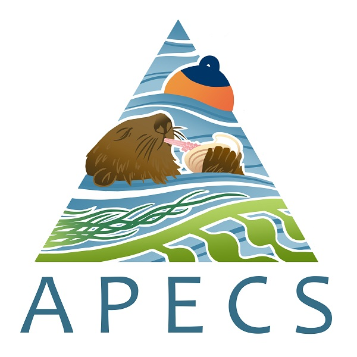

# Welcome to the APECS master repository
In an effort to get with the times, and make our lives easier we have moved to working with git, GitHub and RStudio as a way to archive and track changes to our data and statistical code. We hope that this repository will hold most if not all the data and code for the APECS project. By keeping everything in one place, that also tracks changes to the data and records the direct relationships between code and data we will all save ourselves from a lot of headaches in the future. 

## How does this all work?
What we have done is sturctured our data and code into two types of general folders. One folder, 'ALL_DATA' will hold all data for the project. Yes all the data. Raw data, cleaned data, and the 'digested' data from these parent data. 

### .csv nameing convention
All data **MUST** be a .csv. If you add or generate files please follow the file naming convention XXXX

## What do I *have* to do?
We encourage everybody to create a GitHub account so that you can access the data and the code if you need to. If you are someone that is going to be running analyses then we *strongly* encourage you to learn the basics of GitHub and how it interfaces with RStudio. Tiff and Wendel feel like they have enough of a basic understnading to get these people up to speed. Fortuently there are great resources online, and here in Juneau (Matt Jones and Byrce Mecum) that do this stuff for a living. 

## Best practices for working in the APECS repository
One of the pitfalls of GitHub is that when a version of somthing on your computer does not match the version on GitHub your get whats called a merge conflict. These are not the end of the world but they can create headaches for everone. After some consultation and testing Tiff and Wendel have identified a series of steps to minimize the changes of these conflicts. You should **alwayse** follow this set of steps when working in any of the projects in the APECS repository.

1. Pull
2. Do your work
3. Save it locally (on your machine)
4. Committ
5. Pull
6. Review any merges etc.
7. Push

The goal here is that if you pull right before you push you can be sure that you have the most recent version of everything. 

