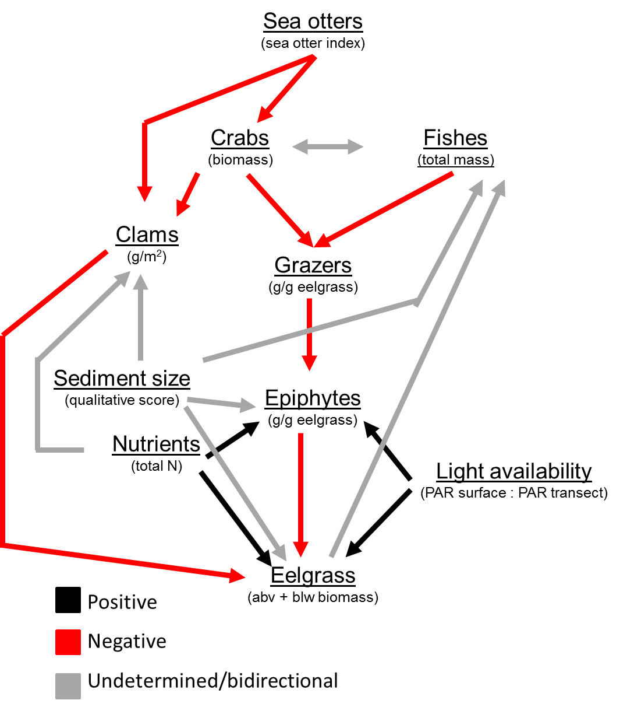

# An SEM approach to eelgrass communities in southeast Alaska
As an alternative to using only limear models we may also be able to describe the eelgrass community structure with strutual equation modeling (SEM). This will follow the apprach and package developed by [Lefcheck](https://jonlefcheck.net/2014/07/06/piecewise-structural-equation-modeling-in-ecological-research/). All of the pre data processing will follow that same as the glm models in other scripts.

```{r libraries, echo=FALSE, message=FALSE, warning=FALSE}
library(dplyr)
library(tidyr)
library(ggplot2)
library(vegan)
library(nlme)
library(lme4)
library(MASS)
library(lmerTest)
library(DT)
library(sjPlot)
library(cowplot)
library(MuMIn)
library(piecewiseSEM)
options(na.action = "na.fail")
theme_set(theme_classic())

st.er <- function(x, na.rm = TRUE) {
  stopifnot(is.numeric(x))
  return(sd(x, na.rm = na.rm)/sqrt(length(x)))
}
```

## Data
**Response metrics**
1. eelgrass aboveground biomass density (g / m^2^)
2. eelgrass belowground biomass density (g / m^2^)
3. eelgrass shoot density (count / m^2^)
4. ratio of aboveground to belowground biomass density (g / m^2^)
5. epiphyte load (g epiphyte / g eelgrass)
6. total grazer load (g grazers/ g eelgrass)
    + gastropod load (g grazers/ g eelgrass)
    + crustaecean load (g grazers/ g eelgrass)
7. crab biomass (g) - can also be counts
8. fish biomass (g) - can also be counts

**Explanatory factors**
1. Sea otter index
2. Time
3. Sediment type (primary sediment type from the "inside" eelgrass transect)
4. Light attenuation
5. crab biomass (g)
6. fish biomass (g)
7. grazer load (g/g)
8. epiphyte load (g/g)

```{r import data, echo = FALSE, message = FALSE, warning = FALSE}
## Transect ##
tran.dat <- read.csv("../ALL_DATA/eelgrass_and_grazer_2017_derived.csv", header = TRUE, stringsAsFactors = FALSE)

## Sea Otter Impact Index ##
so.index <- read.csv("../ALL_DATA/sea_otter_impact_index_2017_new.csv", stringsAsFactors = FALSE, header = TRUE)

## Sediment ##
sed.site <- read.csv("../ALL_DATA/TIFF_seagrass_carbon_disturbance/2017_data_efforts/seagrass_seaotter_pit_sediment_2017_RAW.csv", stringsAsFactors = FALSE, header = TRUE)

## Clams ##
clam.dat <- read.csv("../ALL_DATA/seagrass_clam_shells_2017_derived.csv", stringsAsFactors = FALSE, header = TRUE)

## Crab ##
crab.dat <- read.csv("../All_DATA/eelgrass_crab_pot_derived.csv", header = TRUE, stringsAsFactors = FALSE)
crab.dat$string <- as.character(crab.dat$string)

## Fish ##
fish.dat <- read.csv("../ALL_DATA/eelgrass_beach_seine_derived.csv", header = TRUE, stringsAsFactors = FALSE)

## Fish Taxonomy ##
fish.tax <- read.csv("../ALL_DATA/fish_taxonomy_RAW.csv", header = TRUE, stringsAsFactors = FALSE)

## RAW Nutrient Data ##
nut.dat <- read.csv("../ALL_DATA/seagrass_nutrients_2017_RAW.csv", header = TRUE, stringsAsFactors = FALSE)
```

### Data Prep
Sediment data preparation. Average by site.
```{r seds by site, echo=FALSE, results = hide}
seds <- sed.site %>% 
  filter(trans_type == "Inside") %>% 
  group_by(site) %>% 
  summarise(sed_inside_prim = mean(sed1_no, na.rm = TRUE))

dat <- merge(tran.dat, seds, by = "site")
```

Light availability calculation
```{r light avail, echo=FALSE, message=FALSE, warning=FALSE}
dat$light_avail <- (dat$light_intensity_umol.m2.sec_transect / dat$light_intensity_umol.m2.sec_surface)
```

Clam data preparation. Data were collected across three transects measuring 100 X 2 meters for a total survey area of 600 square meters. We will average the clam biomass per square meter across the three transects.
```{r clam mass, }
clam <- clam.dat %>% 
  group_by(Site, Transect) %>% 
  summarise(mass_g_m2 = sum(mass_g)/200) %>% 
  group_by(Site) %>% 
  summarise(clam_mass = mean(mass_g_m2))

dat <- merge(dat, clam, by.x = "site", by.y = "Site")
```


Crab data preparation. This needs to be done to summarise by site and string (i.e. loose species information). Average by site.
```{r crab sites string, echo=FALSE, message=FALSE, warning=FALSE}
crab.site <- crab.dat %>% 
  group_by(site) %>% 
  summarise(crab_count = mean(count, na.rm = TRUE),
            crab_mass = mean(mass_g, na.rm = TRUE))

dat <- merge(dat, crab.site, by = "site")

crab.site.fuk <- crab.dat %>% 
  filter()
```

Crab data preparation. Summarize counts and mass of cancer/rock crabs. Average by site.
```{r rock crabs string, echo=FALSE}
crab.rock <- crab.dat %>% 
  filter(sp_code == "CRABDUN" | sp_code == "CRABRR" | sp_code == "CRAGRA"| sp_code == "UNRKCB") %>% 
  group_by(site) %>% 
    summarise(rock_count = mean(count, na.rm = TRUE),
            rock_mass = mean(mass_g, na.rm = TRUE))

dat <- merge(dat, crab.rock, by = "site")
```

Fish data preparation. 
append taxonomy
```{r}
fish.dat <- merge(fish.dat, fish.tax, by.x = "species_scientific", by.y = "scientific_name", all = TRUE)
```

This needs to be done to summarise by site across all species.
```{r fish site, echo = FALSE}
## Full species List ##
# prep #
fish.site <- fish.dat %>% 
  group_by(site) %>% 
  summarise(fish_count = n(),
            fish_mass = sum(mass_g))

fish.site.sp <- fish.dat %>% 
  group_by(site, sp_code) %>% 
  summarise(count = n()) %>% 
  spread(key = sp_code, value = count)

fish.site.sp[is.na(fish.site.sp)] <- 0

fish.site.sp$fish_SW_diverse <- diversity(fish.site.sp[,2:56], index = "shannon")
fish.site.sp$fish_rich <- rowSums(fish.site.sp[, 2:56] != 0)

# Sum predators # NOW INCLUDES SHINER PERCH #
fish.site.sp$fish_preds <- rowSums(fish.site.sp[, c(2, 7:9, 13, 14, 20, 31:40, 51, 53:55)])

fish.site <- merge(fish.site, fish.site.sp[, c(1, 57:59)], by = "site")

dat <- merge(dat, fish.site, by = "site")

# biomass community matirx #
fishmass.site.sp <- fish.dat %>% 
  group_by(site, sp_code) %>% 
  summarise(mass = sum(mass_g)) %>% 
  spread(key = sp_code, value = mass)

fishmass.site.sp[is.na(fishmass.site.sp)] <- 0

## Group by family counts ##
fish.site.fam <- fish.dat %>% 
  group_by(site, family) %>% 
  summarise(count = n()) %>% 
  spread(key = family, value = count)

fish.site.fam[is.na(fish.site.fam)] <- 0

## Group by family Mass ##
fishmass.site.fam <- fish.dat %>% 
  group_by(site, family) %>% 
  summarise(mass = sum(mass_g)) %>% 
  spread(key = family, value = mass)

fishmass.site.fam[is.na(fishmass.site.fam)] <- 0

dat <- merge(dat, fishmass.site.fam, by = "site")

```

Adding total eelgrass mass
```{r quadratic, echo = FALSE}
## Date ##
dat$eelgrass_total_mass <- (dat$abvgnd_mass + dat$blwgnd_mass)
```

## Analytical Approach
Analysis will follow four major steps.

1. Define a conceptual model that shows all biologically defenseable paths among variables. 
2. Reduce the possible varibles to ones that actually seem important for describing the relationship among variables.
3. Adjust the conceptual model to incule only those varibles which were deemed important from above.
4. Fit SEM

For our analysis we will first define our exogenous and endogenous variables. 

*Exogenous* - varibles that only have paths going away from them
1. Sea otters
2. Nutrients
3. Light availability
4. Sediment
5. Time - kinda, but we will deal with that later

*Endogenous* - variables that have paths coming to them and potentially going away from them
1. Crabs
2. Fish
3. Clams
4. Grazers
5. Epiphytes
6. Eelgrass

### 1. Conceptual model


### 2. Variable reduction
While all the path defined in the above conceptual model are biologically justifiable, they may not be present or important in our data. We will use the `dredge` function to identify variables that have meaningful predictive power for our endogenous varibles of interest. But before we do that we need to assess varibles for normality. 

#### Addressing normality
Total eelgrass biomass is non-normal. Square root fixes it.
```{r total eg mass, echo=FALSE, results = hide}
hist(dat$eelgrass_total_mass, breaks = 20)
shapiro.test(dat$eelgrass_total_mass)

hist(sqrt(dat$eelgrass_total_mass))
shapiro.test(sqrt(dat$eelgrass_total_mass))
```

Epiphyte load is not normal but log transformation fixes it
```{r epi load, echo=FALSE, results = hide }
hist(dat$epiphmass_shootmass)
range(dat$epiphmass_shootmass)
shapiro.test(dat$epiphmass_shootmass)

hist(log(dat$epiphmass_shootmass))
shapiro.test(log(dat$epiphmass_shootmass))
```

Grazer Load is not normal but log transformation fixes it.
```{r grz load, echo=FALSE, results = hide}
hist(dat$grazermass_shootmass)
range(dat$grazermass_shootmass)

hist(log(dat$grazermass_shootmass))
shapiro.test(log(dat$grazermass_shootmass))
```

Crab biomass is not normal but is corrected with sqrt tranformation
```{r crb biomass, echo=FALSE, results = hide}
hist(dat$crab_mass)
shapiro.test(dat$crab_mass)

hist(sqrt(dat$crab_mass))
shapiro.test(sqrt(dat$crab_mass))
```

Fish mass is not normal but log transforamtion fixes it. 
```{r fish pred biomass, echo=FALSE, results = hide}
hist(dat$fish_mass)
shapiro.test(dat$fish_mass)

hist(log(dat$fish_mass))
shapiro.test(log(dat$fish_mass))
```

Clam mass is not normal but sqrt tranformation fixes it.
```{r clam norm, echo=FALSE, results = hide}
hist(dat$clam_mass)
shapiro.test(dat$clam_mass)

hist(sqrt(dat$clam_mass))
shapiro.test(sqrt(dat$clam_mass))
```

Sediment is not normal and there is not a good transformation becasue there are so many low values. I will proceed without transformations.
```{r, echo=FALSE, results = hide}
hist(dat$sed_inside_prim)
shapiro.test(dat$sed_inside_prim)
```

Total Nitrogen is not normal and there is not a good transformation. I will proceed with no transformation
```{r, echo=FALSE, results = hide}
hist(dat$Ntotal_site)
shapiro.test(dat$Ntotal_site)

hist(log(dat$Ntotal_site))
shapiro.test(log(dat$Ntotal_site))
```

Light availability
```{r, echo=FALSE, results = hide}
hist(dat$light_avail)
shapiro.test(dat$light_avail)
```

Factor  | Transformation
------  | --------------
Total eelgrass mass | sqrt
Abv:Blw | none
epi load  | log
grz load  | log
crab  | sqrt
fish  | log
clam  | sqrt
sediment | none
Total N | none
Light avil | none

#### Fitting dredge models
Using the `dredge` function from the MuMIn package we can determine what variables are the most important for describing a certain response. What `drege` does is takes what some would call a "global" to "saturated" model and fits all possible combinations of variables and calcualates and AICc score for that model. We can then use this list of ranked models to determine what variables are important and or correlated with a response of interest. Note that we will only test variables with direct paths (as specified in the conceptual diagram) to a response of interest.

##### Eelgrass
```{r dredge eg}
## Model ##
eg <- lm(sqrt(eelgrass_total_mass) ~ date_julian + log(epiphmass_shootmass) + sqrt(clam_mass) + sqrt(sed_inside_prim) + Ntotal_site + light_avail, data = dat)

## dredge ##
eg.dr <- dredge(eg, rank = "AICc", evaluate = TRUE, extra = "adjR^2")
eg.dr

## Filter top models ##
eg.dr.top <- eg.dr %>% 
  filter(delta <= 4)

## Clean up ##
eg.dr.top <- eg.dr.top[,colSums(is.na(eg.dr.top)) < nrow(eg.dr.top)] # remove columns with 0s
datatable(round(eg.dr.top, 4))
```

