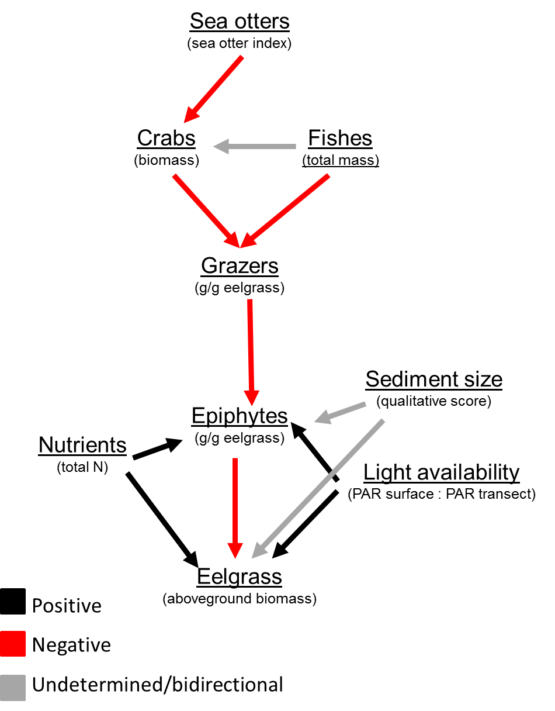

# An SEM approach to eelgrass communities in southeast Alaska
As an alternative to using only limear models we may also be able to describe the eelgrass community structure with strutual equation modeling (SEM). This will follow the apprach and package developed by [Lefcheck](https://jonlefcheck.net/2014/07/06/piecewise-structural-equation-modeling-in-ecological-research/). All of the pre data processing will follow that same as the glm models in other scripts.

```{r libraries, echo=FALSE, message=FALSE, warning=FALSE}
library(dplyr)
library(tidyr)
library(ggplot2)
library(vegan)
library(nlme)
library(lme4)
library(MASS)
library(lmerTest)
library(DT)
library(piecewiseSEM)
options(na.action = "na.fail")
theme_set(theme_classic())

st.er <- function(x, na.rm = TRUE) {
  stopifnot(is.numeric(x))
  return(sd(x, na.rm = na.rm)/sqrt(length(x)))
}
```

## Data
**Response metrics**
1. eelgrass aboveground biomass density (g / m^2^)
2. eelgrass belowground biomass density (g / m^2^)
3. eelgrass shoot density (count / m^2^)
4. ratio of aboveground to belowground biomass density (g / m^2^)
5. epiphyte load (g epiphyte / g eelgrass)
6. total grazer load (g grazers/ g eelgrass)
    + gastropod load (g grazers/ g eelgrass)
    + crustaecean load (g grazers/ g eelgrass)
7. crab biomass (g) - can also be counts
8. fish biomass (g) - can also be counts

**Explanatory factors**
1. Sea otter index
2. Time
3. Sediment type (primary sediment type from the "inside" eelgrass transect)
4. Light attenuation
5. crab biomass (g)
6. fish biomass (g)
7. grazer load (g/g)
8. epiphyte load (g/g)

```{r import data, echo = FALSE, message = FALSE, warning = FALSE}
## Transect ##
tran.dat <- read.csv("../ALL_DATA/eelgrass_and_grazer_2017_derived.csv", header = TRUE, stringsAsFactors = FALSE)

## Sea Otter Impact Index ##
so.index <- read.csv("../ALL_DATA/sea_otter_impact_index_new.csv", stringsAsFactors = FALSE, header = TRUE)

## Pits ##
pits <- read.csv("../ALL_DATA/TIFF_seagrass_carbon_disturbance/2017_data_efforts/seagrass_seaotter_pit_sediment_2017_RAW.csv", stringsAsFactors = FALSE, header = TRUE)

## Sediment ##
sed.site <- read.csv("../ALL_DATA/TIFF_seagrass_carbon_disturbance/2017_data_efforts/seagrass_seaotter_pit_sediment_2017_RAW.csv", stringsAsFactors = FALSE, header = TRUE)

## Crab ##
crab.dat <- read.csv("../All_DATA/eelgrass_crab_pot_derived.csv", header = TRUE, stringsAsFactors = FALSE)
crab.dat$string <- as.character(crab.dat$string)

## Fish ##
fish.dat <- read.csv("../ALL_DATA/eelgrass_beach_seine_derived.csv", header = TRUE, stringsAsFactors = FALSE)

## Fish Taxonomy ##
fish.tax <- read.csv("../ALL_DATA/fish_taxonomy_RAW.csv", header = TRUE, stringsAsFactors = FALSE)

## RAW Nutrient Data ##
nut.dat <- read.csv("../ALL_DATA/seagrass_nutrients_2017_RAW.csv", header = TRUE, stringsAsFactors = FALSE)
nut.temp <- read.csv("../ALL_DATA/site_abiotic_template_2017_RAW.csv", header = TRUE, stringsAsFactors = FALSE)
```

### Data Prep
Sediment data preparation. We will assign the average sediment score from the inside eelgrass bed transect to each site.
```{r seds by site, echo=FALSE}
seds <- sed.site %>% 
  filter(trans_type == "Inside") %>% 
  group_by(site) %>% 
  summarise(sed_inside_prim = mean(sed1_no, na.rm = TRUE),
            sed_inside_prim_se = st.er(sed1_no))

dat <- merge(tran.dat, seds, by = "site")
```

Light availability calculation. Taken as the ratio of light intensity at the eelgrass canopy to the light intensity at the surface.
```{r light avail, echo=FALSE}
dat$light_avail <- (dat$light_intensity_umol.m2.sec_transect / dat$light_intensity_umol.m2.sec_surface)
```

Crab data preparation. This needs to be done to summarise by site and string (i.e. loose species information). Average by site.
```{r crab sites string, echo=FALSE}
crab.site <- crab.dat %>% 
  group_by(site) %>% 
  summarise(crab_count = mean(count, na.rm = TRUE),
            crab_mass = mean(mass_g, na.rm = TRUE),
            crab_mass_se = st.er(mass_g, na.rm = TRUE))

dat <- merge(dat, crab.site, by = "site")
```

Crab data preparation. Summarize counts and mass of cancer/rock crabs. Average by site.
```{r rock crabs string, echo=FALSE}
crab.rock <- crab.dat %>% 
  filter(sp_code == "CRABDUN" | sp_code == "CRABRR" | sp_code == "CRAGRA"| sp_code == "UNRKCB") %>% 
  group_by(site) %>% 
    summarise(rock_count = mean(count, na.rm = TRUE),
            rock_mass = mean(mass_g, na.rm = TRUE))

dat <- merge(dat, crab.rock, by = "site")
```

Fish data preparation. 
Append taxonomy
```{r fish tax, echo=FALSE}
fish.dat <- merge(fish.dat, fish.tax, by.x = "species_scientific", by.y = "scientific_name", all = TRUE)
```

This needs to be done to summarise count as mass by site across all species. Further the sum of fish predator mass will be caluclated.
```{r fish site, echo = FALSE}
## Full species List ##
# prep #
fish.site <- fish.dat %>% 
  group_by(site) %>% 
  summarise(fish_count = n(),
            fish_mass = sum(mass_g))

fish.site.sp <- fish.dat %>% 
  group_by(site, sp_code) %>% 
  summarise(count = n()) %>% 
  spread(key = sp_code, value = count)

fish.site.sp[is.na(fish.site.sp)] <- 0

fish.site.sp$fish_SW_diverse <- diversity(fish.site.sp[,2:56], index = "shannon")
fish.site.sp$fish_rich <- rowSums(fish.site.sp[, 2:56] != 0)

# Sum predators #
fish.site.sp$fish_preds <- rowSums(fish.site.sp[, c(2, 7:9, 13, 20, 31:40, 51, 53:55)])

fish.site <- merge(fish.site, fish.site.sp[, c(1, 57:59)], by = "site")

dat <- merge(dat, fish.site, by = "site")

# biomass community matirx #
fishmass.site.sp <- fish.dat %>% 
  group_by(site, sp_code) %>% 
  summarise(mass = sum(mass_g)) %>% 
  spread(key = sp_code, value = mass)

fishmass.site.sp[is.na(fishmass.site.sp)] <- 0

## Group by family counts ##
fish.site.fam <- fish.dat %>% 
  group_by(site, family) %>% 
  summarise(count = n()) %>% 
  spread(key = family, value = count)

fish.site.fam[is.na(fish.site.fam)] <- 0

## Group by family Mass ##
fishmass.site.fam <- fish.dat %>% 
  group_by(site, family) %>% 
  summarise(mass = sum(mass_g)) %>% 
  spread(key = family, value = mass)

fishmass.site.fam[is.na(fishmass.site.fam)] <- 0

dat <- merge(dat, fishmass.site.fam, by = "site")
```

Look at nutrient data
```{r}
## Summarize good data by site and sampling type ##
nut.sum <- nut.dat %>% 
  filter(site_full != "2017_M_01") %>% 
  filter(quality == "G") %>% 
  group_by(site_full, sampling_type, depth_m) %>% 
  summarise(NOx_umol = mean(nox_umol),
            NH4_umol = mean(nh4_umol),
            PO4_umol = mean(po4_umol),
            NTotal_umol = mean(tot_N),
            N_P = mean(N.P))

## Merge with template ##
abiot.final <- nut.temp[, 1:7]

abiot.final$NOx_umol <- c(nut.sum$NOx_umol[nut.sum$sampling_type == "eelgrass"], nut.sum$NOx_umol[nut.sum$sampling_type == "nutday"])

abiot.final$NH4_umol <- c(nut.sum$NH4_umol[nut.sum$sampling_type == "eelgrass"], nut.sum$NH4_umol[nut.sum$sampling_type == "nutday"])

abiot.final$PO4_umol <- c(nut.sum$PO4_umol[nut.sum$sampling_type == "eelgrass"], nut.sum$PO4_umol[nut.sum$sampling_type == "nutday"])

abiot.final$NTotal_umol <- c(nut.sum$NTotal_umol[nut.sum$sampling_type == "eelgrass"], nut.sum$NTotal_umol[nut.sum$sampling_type == "nutday"])

abiot.final$N_P <- c(nut.sum$N_P[nut.sum$sampling_type == "eelgrass"], nut.sum$N_P[nut.sum$sampling_type == "nutday"])
```

Append total N to dat
```{r}
dat$Ntotal_site <- abiot.final$NTotal_umol[abiot.final$sample_type == "site"]
dat$NOx_site <- abiot.final$NOx_umol[abiot.final$sample_type == "site"]
```

Pits
```{r}
pits.site <- pits %>%
    filter(trans_type == "Inside") %>% 
    group_by(site) %>% 
    summarise(pit_mean= mean(pit_bin),
              pit_se = st.er(pit_bin))

dat$pits_inside <- pits.site$pit_mean

pits.all.site <- pits %>%
    group_by(site) %>% 
    summarise(pit_all_mean= mean(pit_bin),
              pit_all_se = st.er(pit_bin))

pits.all.site <- pits.all.site[2:22,]
dat$pits_all <- pits.all.site$pit_all_mean
```

### Missing data
The diatom cover data does not have a value for one site. There are a few ways to deal with this. One is to omit the data entirely which means omitting the site. I don't really want to do that. The overall mean of the observed could also work. Seeing that the transformation does reasonable well to normalize the data and there is reasonable spread across sites I think we can proceed with this approach. Note that later interpretation will need to address this. Another approach is to take the mean value from sites sampled close in time to site with missing data. This makes logical sense, but then again we did not find a significant time effect. We could also use multiple imputation, but thats hold off.. for now. 
So lets add the mean value. And check normality again. Looks good.
```{r dia missing, echo = FALSE}
ggplot(dat[2:21,]) +
  geom_col(aes(x = site, y = asin(sqrt(diatom_dens/ 100)))) +
  theme(axis.text.x = element_text(angle = 45, hjust = 1))
## add mean value ##
dat[1, 37] <- mean(dat$diatom_dens, na.rm = TRUE)
## assess normality again ##
hist(dat$diatom_dens)
hist(asin(sqrt(dat$diatom_dens / 100)))
shapiro.test(asin(sqrt(dat$diatom_dens / 100)))
```

## Percent cover
transform wiht arcsine square root in the data frame
```{r}
dat$macro_dens_as <- asin(sqrt(dat$macro_dens / 100))
dat$diatom_dens_as <- asin(sqrt(dat$diatom_dens / 100))
```

## Analytical Approach
*Question* Does a sea otter mediated trophic cascade occur in Southeast Alaska? What are the relationships among eelgrass community constiuents, and do sea otters play a role in that?

Analysis will follow four major steps.

1. Define a conceptual model that shows all biologically defenseable paths among variables. 
2. Reduce the possible varibles to ones that actually seem important for describing the relationship among variables.
3. Adjust the conceptual model to incule only those varibles which were deemed important from above.
4. Fit SEM

For our analysis we will first define our exogenous and endogenous variables. 

*Exogenous* - varibles that only have paths going away from them
1. Sea otters
2. Nutrients
3. Light availability
4. Sediment
5. Time - kinda, but we will deal with that later

*Endogenous* - variables that have paths coming to them and potentially going away from them
1. Crabs
2. Fish
3. Grazers
4. Epiphytes
5. Eelgrass

### 1. Conceptual model
Diagram represents all reasonable direct biological paths among the eelgrass associated community.




### 2. Suitable data and variable reduction
Following the rule of thumb that any responce of one of the component models should have 5 >= N/5 predictors, we will evaluate potential component models. For our data set we have N = 21 so 21/5 = 4.2, so any componenet model should have no more than 4 predictors. Looking at the conceptual model no endogenous variables have more than 4 paths going towards them, indicating that we have aduaquate data to fit all the paths. So thats good.

Grace at al 2012 is of the opinion of keeping models simple and tightly defining your question. I tend to agree, especailly considering the low sample size of the study.


### 3. Addressing normality and temporal trends
To meet normality assumptions we will evaluate the data distribution and normality of for exogeneous and endogenous varibles.

#### Exogeneous data normality
Sea otter index. Is somewhat non-normal in its distribution, however tranforming these data (PC1 values) does not make sense. We will proceed with values untransformed.
```{r soi norm, echo = FALSE, results = "hide"}
hist(dat$sea_otter_index_tr, breaks = 10)
```

Nutrients. Is somewhat non-normal. Transformations do not improve it much. These data are just really variable. We will proceed with values untransformed.
```{r nuts norm, echo = FALSE, results = "hide"}
hist(dat$Ntotal_site, breaks = 10)
shapiro.test(dat$Ntotal_site)
```

Light availability. Is reasonably normal. We will proceed with values untransformed.
```{r light norm, echo = FALSE, results = "hide"}
hist(dat$light_avail, breaks = 10)
shapiro.test(dat$light_avail)
```

Semdiment size. Is non-normal. This is driven by a lot of low values. We will proceed with values untransformed.
```{r seds norm, echo = FALSE, results = "hide"}
hist(dat$sed_inside_prim, breaks = 10)
shapiro.test(dat$sed_inside_prim)
```

#### Endogenous data normality
Aboveground eeglrass biomass. Is slightly reasonably normal. We will proceed with values untransformed.
```{r abveg norm, echo = FALSE, results = "hide"}
hist(dat$abvgnd_mass, breaks = 10)
shapiro.test(dat$abvgnd_mass)
```

Epiphyte load. Is non-normal. We will proceed with a *log transformation of epiphyte load*.
```{r epi norm, echo = FALSE, results = "hide"}
hist(dat$epiphmass_shootmass, breaks = 10)
hist(log(dat$epiphmass_shootmass), breaks = 10)
shapiro.test(log(dat$epiphmass_shootmass))
```

Grazer load. Is non-normal. We will proceed with a *log transformation of grazer load*.
```{r grz norm, echo = FALSE, results = "hide"}
hist(dat$grazermass_shootmass, breaks = 10)
hist(log(dat$grazermass_shootmass), breaks = 10)
shapiro.test(log(dat$grazermass_shootmass))
```

Fish total mass. Is non-normal. We will proceed with a *log transformation of fish biomass*.
```{r fish norm, echo = FALSE, results = "hide"}
hist(dat$fish_mass, breaks = 10)
hist(log(dat$fish_mass), breaks = 10)
shapiro.test(log(dat$fish_mass))
```

Crab total mass. Is non-normal. We will procees with a *square root transfromation of crab biomass*.
```{r crab norm, echo = FALSE, results = "hide"}
hist(dat$crab_mass, breaks = 10)
hist(log(dat$crab_mass), breaks = 10)
hist(sqrt(dat$crab_mass), breaks = 10)
shapiro.test(log(dat$crab_mass))
shapiro.test(sqrt(dat$crab_mass))
```

Macroalgae percent cover. Is non-normal. Transformations do not do that much. Considering that its percent cover data we will proceed with a *asin(sqrt()) transformation*.
```{r macro norm, echo=FALSE, results = "hide"}
hist(dat$macro_dens, breaks = 10)
hist(asin(sqrt((dat$macro_dens / 100))), breaks = 10)
```

Diatom percent cover. Is non-normal. Transformations do not do that much. Considering that its percent cover data we will proceed with a *asin(sqrt()) transformation*.
```{r dia norm, echo = FALSE, results = "hide"}
hist(dat$diatom_dens, breaks = 10)
hist(asin(sqrt((dat$diatom_dens / 100))), breaks = 10)
```

#### Temporal change
Eelgrass aboveground biomass has a strong temporal signal. *Eelgrass aboveground biomass will be de-trended*.
```{r abv mass time, echo = FALSE}
## Assess temporal trend ##
plot(dat$date_julian, dat$abvgnd_mass)
tmod1 <- lm(dat$abvgnd_mass ~ dat$date_julian)
summary(tmod1)

## De-trend ##
resid.abv <- residuals(tmod1)
dat$abvgnd_mass_dt <- resid.abv
plot(dat$date_julian, dat$abvgnd_mass_dt)
```

Epiphyte load has a significant negative relationships with epiphyte load. *epiphyte load will be de-trended*.
```{r epi time, echo = FALSE}
## Assess temporal trend ##
plot(dat$date_julian, log(dat$epiphmass_shootmass))
tmod2 <- lm(log(dat$epiphmass_shootmass) ~ dat$date_julian)
summary(tmod2)

## De-trend ##
resid.epi <- residuals(tmod2)
dat$epiphmass_shootmass_dt <- resid.epi
plot(dat$date_julian, log(dat$epiphmass_shootmass_dt))
```

Grazer load looks like it may have a temporal signal but its turns out that its not significant and has a low R-sq value.
```{r grz time, echo = FALSE}
## Assess temporal trend ##
plot(dat$date_julian, log(dat$grazermass_shootmass))
tmod3 <- lm(log(dat$grazermass_shootmass) ~ dat$date_julian)
summary(tmod3)
```

Crabmass
```{r crb time, echo = FALSE}
## Assess temporal trend ##
plot(dat$date_julian, sqrt(dat$crab_mass))
```

Macroalgae
```{r macro time, echo = FALSE}
## Assess temporal trend ##
plot(dat$date_julian, asin(sqrt(dat$macro_dens / 100)))
tmod4 <- lm(asin(sqrt(dat$macro_dens / 100)) ~ dat$date_julian)
summary(tmod4)
```

Diatoms have a reasonable correlation with time. *Diatom percent cover will we detrended*
```{r dia time, echo = FALSE}
## Assess temporal trend ##
dat[1, 67] <- 0
plot(dat$date_julian, asin(sqrt(dat$diatom_dens / 100)))
tmod5 <- lm(asin(sqrt(dat$diatom_dens / 100)) ~ dat$date_julian)    
summary(tmod5)

## de-trend ##
resid.dia <- residuals(tmod5)
dat$diatom_dens_dt <- resid.dia
plot(dat$date_julian, log(dat$diatom_dens_dt))
```

### 4. Set of structural equations
#### Final variable set for full model
*Exogeneous*
1. Sea otters
2. Total water nitrogen
3. Light availability
4. Sediment 

*Endogeneous*
1. Eelgrass (as abovegound biomass - de-trended with respect to julian day)
2. Epiphytes (as epiphte load - log trasformed and de-trended with respect to julian day)
3. Grazers (as grazer load - log transformed)
4. Fish (as total fish biomass - log tranformed)
5. Crabs (as total crab biomass - square-root transformed)

#### Simplified data
To simplify the analysis work space I will create a new data frame with all the data I am going to use in its final form. So tranfromed and de-trended where appropriate.
```{r dat redu, echo=FALSE}
dat.redu <- dat[,1:6]
dat.redu$abvgnd_mass_dt <- dat$abvgnd_mass_dt
dat.redu$epiphmass_shootmass_ln_dt <- dat$epiphmass_shootmass_dt
dat.redu$grazermass_shoot_ln <- log(dat$grazermass_shootmass)
dat.redu$fish_mass_ln <- log(dat$fish_mass)
dat.redu$crab_mass_sq <- sqrt(dat$crab_mass)
dat.redu$sea_otter_index_tr <- dat$sea_otter_index_tr
dat.redu$diatom_dens <- dat$diatom_dens
dat.redu$macro_dens <- dat$macro_dens
dat.redu$light_avail <- dat$light_avail
dat.redu$NOx_site <- dat$NOx_site
dat.redu$n_pits <- dat$n_pits
```

#### 5. Full SEM
##### SEM 1
Following paths indicated in figure
```{r full sem}
sem.1 <- psem(
  lm(crab_mass_sq ~ sea_otter_index_tr, data = dat.redu),

  lm(grazermass_shoot_ln ~ crab_mass_sq + fish_mass_ln + macro_dens + diatom_dens, data = dat.redu),
  
  lm(epiphmass_shootmass_ln_dt ~ grazermass_shoot_ln + NOx_site + light_avail, data = dat.redu),
  
  lm(abvgnd_mass_dt ~ epiphmass_shootmass_ln_dt + NOx_site + light_avail + n_pits, data = dat.redu)

)
```

###### Model checking and diagnostics
Below we will run through model components and diagnostics.

###### Basis Set
```{r basis diag1, echo=FALSE, results = "hide"}
basisSet(sem.1)
```

###### d-seperation
No evidence of any d-separation
```{r dsep1, echo = FALSE}
dsep.1 <- dSep(sem.1, .progressBar = FALSE)
dsep.1
```

###### Fisher's C
High p-value, indicating that the model is good.
```{r fish C1, echo = FALSE}
fisherC(dsep.1)
```

###### Coefficients and R-sq
```{r coef rsq1, echo=FALSE}
coefs(sem.1)
rsquared(sem.1)
```

###### Full output
```{r sem1 out}
summary(sem.1, .progressBar = FALSE)
```

##### SEM 2
Given the restuls from the first SEM I will attempt to refine the model. Given that there was no indocation of d-sep I will focus on the specified paths. There are a few variables that have very little explanatory power. Abv mass - light and grazer - fish.

```{r sem2}
sem.2 <- psem(
  lm(crab_mass_sq ~ sea_otter_index_tr + fish_mass_ln, data = dat.redu),

  lm(grazermass_shoot_ln ~ crab_mass_sq, data = dat.redu),
  
  lm(epiphmass_shootmass_ln_dt ~ grazermass_shoot_ln + sed_inside_prim + Ntotal_site + light_avail, data = dat.redu),
  
  lm(abvgnd_mass_dt ~ epiphmass_shootmass_ln_dt + sed_inside_prim + Ntotal_site, data = dat.redu)

)
```

###### Basis Set
```{r basis diag, echo=FALSE, results = "hide"}
basisSet(sem.2)
```

###### d-seperation
No evidence of any d-separation
```{r dsep2, echo = FALSE}
dsep.2 <- dSep(sem.2, .progressBar = FALSE)
dsep.2
```

###### Fisher's C
High p-value, indicating that the model is good.
```{r fish C2, echo = FALSE}
fisherC(dsep.2)
```

###### Coefficients and R-sq
```{r coef rsq2, echo=FALSE}
coefs(sem.2)
rsquared(sem.2)
```

###### Full output
```{r sem2 out}
summary(sem.2, .progressBar = FALSE)
```

##### Compare SEM 1 and SEM2
Looking at AIC and Fisher C values SEM 2 seems to be an improvement.
```{r sem1 sem2 comp}
AIC(sem.1, sem.2)
fisherC(dsep.1)
fisherC(dsep.2)
```

##### SEM 3
Can we refine SEM 2? Given the restuls from the first SEM I will attempt to refine the model. Given that there was no indocation of d-sep I will focus on the specified paths. There are a few variables that have very little explanatory power. Epi - light, Epi - Ntotal and Abv mass - Ntotal.

```{r sem3}
sem.3 <- psem(
  lm(crab_mass_sq ~ sea_otter_index_tr + fish_mass_ln, data = dat.redu),

  lm(grazermass_shoot_ln ~ crab_mass_sq, data = dat.redu),
  
  lm(epiphmass_shootmass_ln_dt ~ grazermass_shoot_ln + sed_inside_prim, data = dat.redu),
  
  lm(abvgnd_mass_dt ~ epiphmass_shootmass_ln_dt + sed_inside_prim, data = dat.redu)

)
```

###### Basis Set
```{r basis diag3, echo=FALSE, results = "hide"}
basisSet(sem.3)
```

###### d-seperation
No evidence of any d-separation
```{r dsep3, echo = FALSE}
dsep.3 <- dSep(sem.3, .progressBar = FALSE)
dsep.3
```

###### Fisher's C
High p-value, indicating that the model is good.
```{r fish C3, echo = FALSE}
fisherC(dsep.3)
```

###### Coefficients and R-sq
```{r coef rsq3, echo=FALSE}
coefs(sem.3)
rsquared(sem.3)
```

###### Full output
```{r sem3 out}
summary(sem.3, .progressBar = FALSE)
```

##### Compare SEM 2 and SEM 3
Pretty big drop in AIC and Fisher C is still pretty good. SEM 3 looks better. Now, there were no "significant" d-sep terms but the sea otter abv is 0.09, which is somewhat suggestive. So I will fit another model with that term and compare.
```{r sem2 sem3 comp}
AIC(sem.2, sem.3)
fisherC(dsep.2)
fisherC(dsep.3)
```

##### SEM 3.2
add sea otter in abv mass equation.
```{r sem3.2}
sem.3.2 <- psem(
  lm(crab_mass_sq ~ sea_otter_index_tr + fish_mass_ln, data = dat.redu),

  lm(grazermass_shoot_ln ~ crab_mass_sq, data = dat.redu),
  
  lm(epiphmass_shootmass_ln_dt ~ grazermass_shoot_ln + sed_inside_prim, data = dat.redu),
  
  lm(abvgnd_mass_dt ~ epiphmass_shootmass_ln_dt + sed_inside_prim + sea_otter_index_tr, data = dat.redu)

)
```

###### Basis Set
```{r basis diag3.2, echo=FALSE, results = "hide"}
basisSet(sem.3.2)
```

###### d-seperation
No evidence of any d-separation
```{r dsep3.2, echo = FALSE}
dsep.3.2 <- dSep(sem.3.2, .progressBar = FALSE)
dsep.3
```

###### Fisher's C
High p-value, indicating that the model is good.
```{r fish C3.2, echo = FALSE}
fisherC(dsep.3.2)
```

###### Coefficients and R-sq
```{r coef rsq3.2, echo=FALSE}
coefs(sem.3.2)
rsquared(sem.3.2)
```

###### Full output
```{r sem 3.2 out}
summary(sem.3.2, .progressBar = FALSE)
```

##### Compare SEM 3 to SEM 3.2
```{r sem3 sem3.2 comp}
AIC(sem.3, sem.3.2)
fisherC(dsep.3)
fisherC(dsep.3.2)
```

