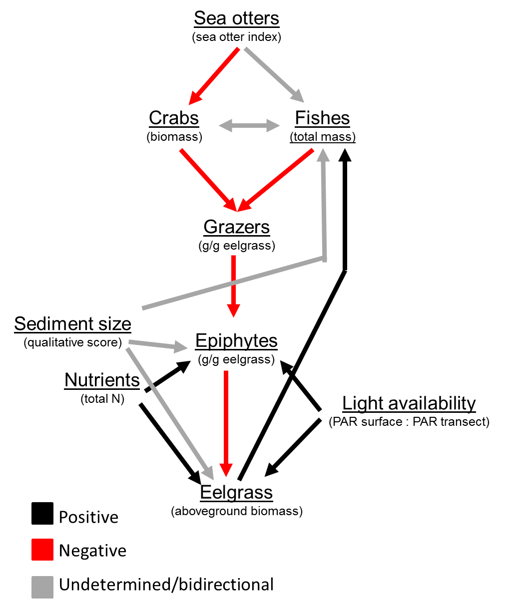

# An SEM approach to eelgrass communities in southeast Alaska
As an alternative to using only limear models we may also be able to describe the eelgrass community structure with strutual equation modeling (SEM). This will follow the apprach and package developed by [Lefcheck](https://jonlefcheck.net/2014/07/06/piecewise-structural-equation-modeling-in-ecological-research/). All of the pre data processing will follow that same as the glm models in other scripts.

```{r libraries, echo=FALSE, message=FALSE, warning=FALSE}
library(dplyr)
library(tidyr)
library(ggplot2)
library(vegan)
library(nlme)
library(lme4)
library(MASS)
library(lmerTest)
library(DT)
library(sjPlot)
library(cowplot)
library(MuMIn)
library(piecewiseSEM)
options(na.action = "na.fail")
theme_set(theme_classic())

st.er <- function(x, na.rm = TRUE) {
  stopifnot(is.numeric(x))
  return(sd(x, na.rm = na.rm)/sqrt(length(x)))
}
```

## Data
**Response metrics**
1. eelgrass aboveground biomass density (g / m^2^)
2. eelgrass belowground biomass density (g / m^2^)
3. eelgrass shoot density (count / m^2^)
4. ratio of aboveground to belowground biomass density (g / m^2^)
5. epiphyte load (g epiphyte / g eelgrass)
6. total grazer load (g grazers/ g eelgrass)
    + gastropod load (g grazers/ g eelgrass)
    + crustaecean load (g grazers/ g eelgrass)
7. crab biomass (g) - can also be counts
8. fish biomass (g) - can also be counts

**Explanatory factors**
1. Sea otter index
2. Time
3. Sediment type (primary sediment type from the "inside" eelgrass transect)
4. Light attenuation
5. crab biomass (g)
6. fish biomass (g)
7. grazer load (g/g)
8. epiphyte load (g/g)

```{r import data, echo = FALSE, message = FALSE, warning = FALSE}
## Transect ##
tran.dat <- read.csv("../ALL_DATA/eelgrass_and_grazer_2017_derived.csv", header = TRUE, stringsAsFactors = FALSE)

## Sea Otter Impact Index ##
so.index <- read.csv("../ALL_DATA/sea_otter_impact_index_new.csv", stringsAsFactors = FALSE, header = TRUE)

## Sediment ##
sed.site <- read.csv("../ALL_DATA/TIFF_seagrass_carbon_disturbance/2017_data_efforts/seagrass_seaotter_pit_sediment_2017_RAW.csv", stringsAsFactors = FALSE, header = TRUE)

## Crab ##
crab.dat <- read.csv("../All_DATA/eelgrass_crab_pot_derived.csv", header = TRUE, stringsAsFactors = FALSE)
crab.dat$string <- as.character(crab.dat$string)

## Fish ##
fish.dat <- read.csv("../ALL_DATA/eelgrass_beach_seine_derived.csv", header = TRUE, stringsAsFactors = FALSE)

## Fish Taxonomy ##
fish.tax <- read.csv("../ALL_DATA/fish_taxonomy_RAW.csv", header = TRUE, stringsAsFactors = FALSE)

## RAW Nutrient Data ##
nut.dat <- read.csv("../ALL_DATA/seagrass_nutrients_2017_RAW.csv", header = TRUE, stringsAsFactors = FALSE)
```

### Data Prep
Sediment data preparation. Average by site.
```{r seds by site, echo=FALSE, results = hide}
seds <- sed.site %>% 
  filter(trans_type == "Inside") %>% 
  group_by(site) %>% 
  summarise(sed_inside_prim = mean(sed1_no, na.rm = TRUE))

dat <- merge(tran.dat, seds, by = "site")
```

Light availability calculation
```{r light avail, echo=FALSE, message=FALSE, warning=FALSE}
dat$light_avail <- (dat$light_intensity_umol.m2.sec_transect / dat$light_intensity_umol.m2.sec_surface)
```

Clam data preparation. Data were collected across three transects measuring 100 X 2 meters for a total survey area of 600 square meters. We will average the clam biomass per square meter across the three transects.
```{r clam mass, }
clam <- clam.dat %>% 
  group_by(Site, Transect) %>% 
  summarise(mass_g_m2 = sum(mass_g)/200) %>% 
  group_by(Site) %>% 
  summarise(clam_mass = mean(mass_g_m2))

dat <- merge(dat, clam, by.x = "site", by.y = "Site")
```


Crab data preparation. This needs to be done to summarise by site and string (i.e. loose species information). Average by site.
```{r crab sites string, echo=FALSE, message=FALSE, warning=FALSE}
crab.site <- crab.dat %>% 
  group_by(site) %>% 
  summarise(crab_count = mean(count, na.rm = TRUE),
            crab_mass = mean(mass_g, na.rm = TRUE))

dat <- merge(dat, crab.site, by = "site")

crab.site.fuk <- crab.dat %>% 
  filter()
```

Crab data preparation. Summarize counts and mass of cancer/rock crabs. Average by site.
```{r rock crabs string, echo=FALSE}
crab.rock <- crab.dat %>% 
  filter(sp_code == "CRABDUN" | sp_code == "CRABRR" | sp_code == "CRAGRA"| sp_code == "UNRKCB") %>% 
  group_by(site) %>% 
    summarise(rock_count = mean(count, na.rm = TRUE),
            rock_mass = mean(mass_g, na.rm = TRUE))

dat <- merge(dat, crab.rock, by = "site")
```

Fish data preparation. 
append taxonomy
```{r}
fish.dat <- merge(fish.dat, fish.tax, by.x = "species_scientific", by.y = "scientific_name", all = TRUE)
```

This needs to be done to summarise by site across all species.
```{r fish site, echo = FALSE}
## Full species List ##
# prep #
fish.site <- fish.dat %>% 
  group_by(site) %>% 
  summarise(fish_count = n(),
            fish_mass = sum(mass_g))

fish.site.sp <- fish.dat %>% 
  group_by(site, sp_code) %>% 
  summarise(count = n()) %>% 
  spread(key = sp_code, value = count)

fish.site.sp[is.na(fish.site.sp)] <- 0

fish.site.sp$fish_SW_diverse <- diversity(fish.site.sp[,2:56], index = "shannon")
fish.site.sp$fish_rich <- rowSums(fish.site.sp[, 2:56] != 0)

# Sum predators # NOW INCLUDES SHINER PERCH #
fish.site.sp$fish_preds <- rowSums(fish.site.sp[, c(2, 7:9, 13, 14, 20, 31:40, 51, 53:55)])

fish.site <- merge(fish.site, fish.site.sp[, c(1, 57:59)], by = "site")

dat <- merge(dat, fish.site, by = "site")

# biomass community matirx #
fishmass.site.sp <- fish.dat %>% 
  group_by(site, sp_code) %>% 
  summarise(mass = sum(mass_g)) %>% 
  spread(key = sp_code, value = mass)

fishmass.site.sp[is.na(fishmass.site.sp)] <- 0

## Group by family counts ##
fish.site.fam <- fish.dat %>% 
  group_by(site, family) %>% 
  summarise(count = n()) %>% 
  spread(key = family, value = count)

fish.site.fam[is.na(fish.site.fam)] <- 0

## Group by family Mass ##
fishmass.site.fam <- fish.dat %>% 
  group_by(site, family) %>% 
  summarise(mass = sum(mass_g)) %>% 
  spread(key = family, value = mass)

fishmass.site.fam[is.na(fishmass.site.fam)] <- 0

dat <- merge(dat, fishmass.site.fam, by = "site")

```

Adding total eelgrass mass
```{r quadratic, echo = FALSE}
## Date ##
dat$eelgrass_total_mass <- (dat$abvgnd_mass + dat$blwgnd_mass)
```

## Analytical Approach
Analysis will follow four major steps.

1. Define a conceptual model that shows all biologically defenseable paths among variables. 
2. Reduce the possible varibles to ones that actually seem important for describing the relationship among variables.
3. Adjust the conceptual model to incule only those varibles which were deemed important from above.
4. Fit SEM

For our analysis we will first define our exogenous and endogenous variables. 

*Exogenous* - varibles that only have paths going away from them
1. Sea otters
2. Nutrients
3. Light availability
4. Sediment
5. Time - kinda, but we will deal with that later

*Endogenous* - variables that have paths coming to them and potentially going away from them
1. Crabs
2. Fish
3. Grazers
4. Epiphytes
5. Eelgrass

### 1. Conceptual model
Diagram represents all reasonable direct biological paths among the eelgrass associated community. Note that clam data are omitted. Upon futher thought it was determined that thoes data are just too different from the rest of the data. They represent dead clams not alive ones, and we have no way to tell how old they are.




### 2. Suitable data and variable reduction
Following the rule of thumb that any responce of one of the component models should have 5 >= N/5 predictors, we will evaluate potential component models. For our data set we have N = 21 so 21/5 = 4.2, so any componenet model should have no more than 4 predictors. Looking at the conceptual model no endogenous variables have more than 4 paths going towards them, indicating that we have aduaquate data to fit all the pahts.

### 3. Addressing normality and temporal trends
To meet normality assumptions we will evaluate the data distribution and normality of for exogeneous and endogenous varibles.

#### Exogeneous data normality
Sea otter index. Is somewhat non-normal in its distribution, however tranforming these data (PC1 values) does not make sense. We will proceed with values untransformed.
```{r soi norm, echo = FALSE}
hist(dat$sea_otter_index_tr, breaks = 10)
```

Nutrients. Is somewhat non-normal. Transformations do not improve it much. These data are just really variable. We will proceed with values untransformed.
```{r nuts norm, echo = FALSE}
hist(dat$Ntotal_site, breaks = 10)
shapiro.test(dat$Ntotal_site)
```

Light availability. Is reasonably normal. We will proceed with values untransformed.
```{r light norm, echo = FALSE}
hist(dat$light_avail, breaks = 10)
shapiro.test(dat$light_avail)
```

Semdiment size. Is non-normal. This is driven by a lot of low values. We will proceed with values untransformed.
```{r seds norm, echo = FALSE}
hist(dat$sed_inside_prim, breaks = 10)
shapiro.test(dat$sed_inside_prim)
```

#### Endogenous data normality
Aboveground eeglrass biomass. Is slightly reasonably normal. We will proceed with values untransformed.
```{r abveg norm, echo = FALSE}
hist(dat$abvgnd_mass, breaks = 10)
shapiro.test(dat$abvgnd_mass)
```

Epiphyte load. Is non-normal. We will proceed with a *log transformation of epiphyte load*.
```{r epi norm, echo = FALSE}
hist(dat$epiphmass_shootmass, breaks = 10)
hist(log(dat$epiphmass_shootmass), breaks = 10)
shapiro.test(log(dat$epiphmass_shootmass))
```

Grazer load. Is non-normal. We will proceed with a *log transformation of grazer load*.
```{r grz norm, echo = FALSE}
hist(dat$grazermass_shootmass, breaks = 10)
hist(log(dat$grazermass_shootmass), breaks = 10)
shapiro.test(log(dat$grazermass_shootmass))
```

Fish total mass. Is non-normal. We will proceed with a *log transformation of fish biomass*.
```{r fish norm, echo = FALSE}
hist(dat$fish_mass, breaks = 10)
hist(log(dat$fish_mass), breaks = 10)
shapiro.test(log(dat$fish_mass))
```

Crab total mass. Is non-normal. We will procees with a *square root transfromation of crab biomass*.
```{r crab norm, echo = FALSE}
hist(dat$crab_mass, breaks = 10)
hist(log(dat$crab_mass), breaks = 10)
hist(sqrt(dat$crab_mass), breaks = 10)
shapiro.test(log(dat$crab_mass))
shapiro.test(sqrt(dat$crab_mass))
```

#### Temporal change
Due to our sampling regime we need to assess if time has a string signal with any of out data.
```{r time cor, echo = FLASE}
pairs(dat[,c(4,21,52,97,103,111,117,118,121,125)])
```

Eelgrass aboveground biomass has a strong temporal signal. *Eelgrass aboveground biomass will be de-trended*.
```{r abv mass time, echo = FALSE}
## Assess temporal trend ##
plot(dat$date_julian, dat$abvgnd_mass)
tmod1 <- lm(dat$abvgnd_mass ~ dat$date_julian)
summary(tmod1)

## De-trend ##
resid.abv <- residuals(tmod1)
dat$abvgnd_mass_dt <- resid.abv
plot(dat$date_julian, dat$abvgnd_mass_dt)
```

Epiphyte load has a significant negative relationships with epiphyte load. *epiphyte load will be de-trended*.
```{r epi time, echo = FALSE}
## Assess temporal trend ##
plot(dat$date_julian, log(dat$epiphmass_shootmass))
tmod2 <- lm(log(dat$epiphmass_shootmass) ~ dat$date_julian)
summary(tmod2)

## De-trend ##
resid.epi <- residuals(tmod2)
dat$epiphmass_shootmass_dt <- resid.epi
plot(dat$date_julian, log(dat$epiphmass_shootmass_dt))
```

Grazer load looks like it may have a temporal signal but its turns out that its not significant and has a low R-sq value.
```{r grz time, echo = false}
plot(dat$date_julian, log(dat$grazermass_shootmass))
tmod3 <- lm(log(dat$grazermass_shootmass) ~ dat$date_julian)
summary(tmod3)
```

Crabmass
```{r}
plot(dat$date_julian, sqrt(dat$crab_mass))
```

### 4. Set of structural equations
#### Final variable set for full model
*Exogeneous*
1. Sea otters
2. Total water nitrogen
3. Light availability
4. Sediment 

*Endogeneous*
1. Eelgrass (as abovegound biomass - de-trended with respect to julian day)
2. Epiphytes (as epiphte load - log trasformed and de-trended with respect to julian day)
3. Grazers (as grazer load - log transformed)
4. Fish (as total fish biomass - log tranformed)
5. Crabs (as total crab biomass - square-root transformed)

#### Simplified data
To simplify the analysis work space I will create a new data frame with all the data I am going to use in its final form. So tranfromed and de-trended where appropriate.
```{r dat redu}
dat.redu <- dat[,1:6]
dat.redu$abvgnd_mass_dt <- dat$abvgnd_mass_dt
dat.redu$epiphmass_shootmass_ln_dt <- dat$epiphmass_shootmass_dt
dat.redu$grazermass_shoot_ln <- log(dat$grazermass_shootmass)
dat.redu$fish_mass_ln <- log(dat$fish_mass)
dat.redu$crab_mass_sq <- sqrt(dat$crab_mass)
dat.redu$sea_otter_index_tr <- dat$sea_otter_index_tr
dat.redu$sed_inside_prim <- dat$sed_inside_prim
dat.redu$Ntotal_site <- dat$Ntotal_site
dat.redu$light_avail <- dat$light_avail
```


#### Full SEM
```{r full sem,}
sem.full <- psem(
  lm(crab_mass_sq ~ sea_otter_index_tr + fish_mass_ln, data = dat.redu),

  lm(grazermass_shoot_ln ~ crab_mass_sq + fish_mass_ln, data = dat.redu),
  
  lm(epiphmass_shootmass_ln_dt ~ grazermass_shoot_ln + sed_inside_prim + Ntotal_site + light_avail, data = dat.redu),
  
  lm(abvgnd_mass_dt ~ epiphmass_shootmass_ln_dt + sed_inside_prim + Ntotal_site + light_avail, data = dat.redu)

)
```

### 5. Model diagnostics
Below we will run through model diagnostics.

#### Basis Set
```{r basis diag, echo=FLASE}
basisSet(sem.full)
```


### 6. Model refinement
