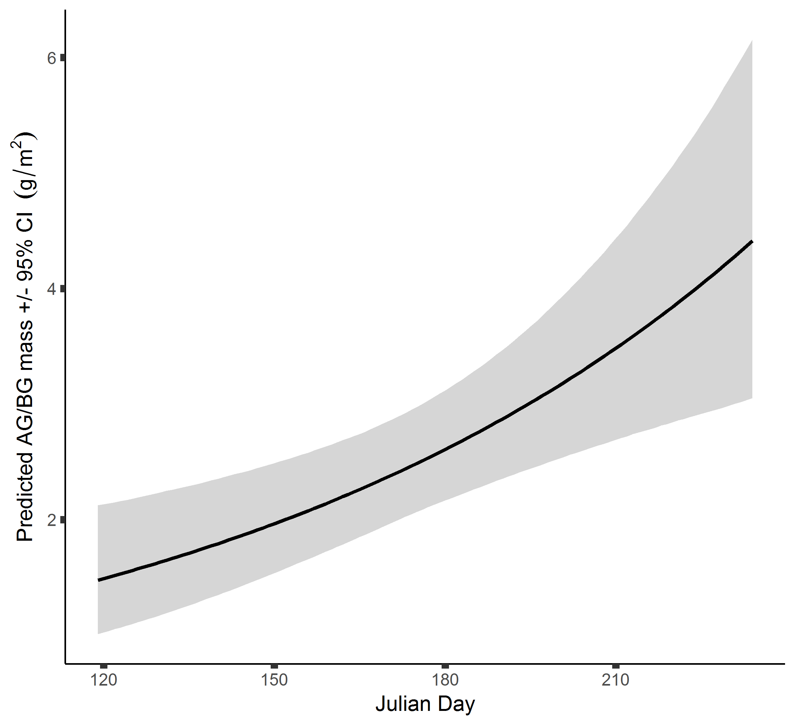
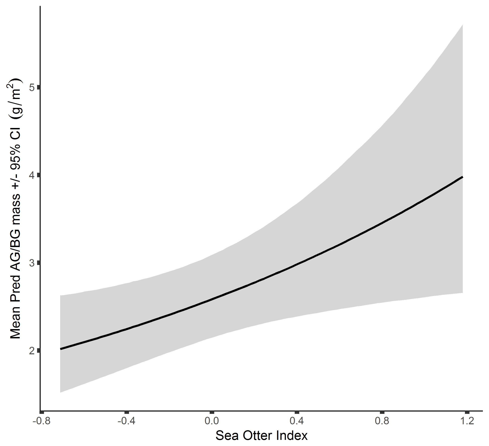

# Summaries from analysis of eelgrass community structure of 2017 data
```{r libraries, echo=FALSE, message=FALSE, warning=FALSE}
library(ggplot2)
library(DT)
library(cowplot)
```

```{r data, echo = FALSE}
mod1.sumstats <- read.csv("EG_Mod1_sumstats.csv", header = TRUE, stringsAsFactors = FALSE)
mod1.WAIC <- read.csv("EG_Mod1_WAIC.csv", header = TRUE, stringsAsFactors = FALSE)
mod1.LOOIC <- read.csv("EG_Mod1_LOOIC.csv", header = TRUE, stringsAsFactors = FALSE)

mod2.sumstats <- read.csv("EG_Mod2_sumstats.csv", header = TRUE, stringsAsFactors = FALSE)
mod2.WAIC <- read.csv("EG_Mod2_WAIC.csv", header = TRUE, stringsAsFactors = FALSE)
mod2.LOOIC <- read.csv("EG_Mod2_LOOIC.csv", header = TRUE, stringsAsFactors = FALSE)

mod3.sumstats <- read.csv("EG_Mod3_sumstats.csv", header = TRUE, stringsAsFactors = FALSE)
mod3.WAIC <- read.csv("EG_Mod3_WAIC.csv", header = TRUE, stringsAsFactors = FALSE)
mod3.LOOIC <- read.csv("EG_Mod3_LOOIC.csv", header = TRUE, stringsAsFactors = FALSE)

mod4.sumstats <- read.csv("EG_Mod4_sumstats.csv", header = TRUE, stringsAsFactors = FALSE)
mod4.WAIC <- read.csv("EG_Mod4_WAIC.csv", header = TRUE, stringsAsFactors = FALSE)
mod4.LOOIC <- read.csv("EG_Mod4_LOOIC.csv", header = TRUE, stringsAsFactors = FALSE)

mod5.sumstats <- read.csv("EG_Mod5_sumstats.csv", header = TRUE, stringsAsFactors = FALSE)
mod5.WAIC <- read.csv("EG_Mod5_WAIC.csv", header = TRUE, stringsAsFactors = FALSE)
mod5.LOOIC <- read.csv("EG_Mod5_LOOIC.csv", header = TRUE, stringsAsFactors = FALSE)
```

Model Coefficients and their real meanings
```{r coefs, echo = FALSE}
coefs <- data.frame(Coefs = c("sigS", "sigO", "beta0", "beta1", "beta1b", "beta2", "beta2b", "beta3", "beta4", "beta5"), Names = c("among site", "within site", "intercept", "time", "time^2", "SOI", "SOI^2", "sediment", "light", "grazer load"))

DT::datatable(coefs, options = list(pageLength = 10))
```


## Model 1 - Aboveground biomass
Response - log normally distributed. We hypothesis that time (as Julian day), sea otter index, sediment type, and light attenuation may effect aboveground biomass of eelgrass.

Model comparison - WAIC
```{r mod1 WAIC, echo=FALSE}
DT::datatable(mod1.WAIC, options = list(pageLength = nrow(mod1.WAIC)))
```

Model comparison - LOOIC
```{r mod1 LOOIC, echo=FALSE}
DT::datatable(mod1.LOOIC, options = list(pageLength = nrow(mod1.LOOIC)))
```

Best models comparisons
```{r best mod1s, echo=FALSE}
DT::datatable(mod1.sumstats, options = list(pageLength = nrow(mod1.sumstats)))

ggplot(mod1.sumstats, aes(color = Model)) +
  geom_hline(yintercept = 0, lty = 2) +
  geom_linerange(aes(Coef, ymin = Lower95, ymax = Upper95), lwd = 1.5, position = position_dodge(width = 1/2)) +
  geom_point(aes(Coef, Median), size = 3, position = position_dodge(width = 1/2)) +
  coord_flip() + 
  scale_y_continuous(breaks = seq(-1.5, 4, by = 0.5)) +
  labs(x = "Coefficient Name", y = " Coefficient Value +/- CI")
```

The best model is 1h, which include quadratic effects of time and SOI.
**Predicted effects - time.**


**Predicted effects - sea otter index.**


## Model 2 - Belowground biomass
Response - log normally distributed. We hypothesis that time (as Julian day), sea otter index, sediment type, and light attenuation may effect aboveground biomass of eelgrass.

Model comparison - WAIC
```{r mod2 WAIC, echo=FALSE}
DT::datatable(mod2.WAIC, options = list(pageLength = nrow(mod2.WAIC)))
```

Model comparison - LOOIC
```{r mod2 LOOIC, echo=FALSE}
DT::datatable(mod2.LOOIC, options = list(pageLength = nrow(mod2.LOOIC)))
```

Best models comparisons
```{rbest mod2s, echo=FALSE}
DT::datatable(mod2.sumstats, options = list(pageLength = nrow(mod2.sumstats)))

ggplot(mod2.sumstats, aes(color = Model)) +
  geom_hline(yintercept = 0, lty = 2) +
  geom_linerange(aes(Coef, ymin = Lower95, ymax = Upper95), lwd = 1.5, position = position_dodge(width = 1/2)) +
  geom_point(aes(Coef, Median), size = 3, position = position_dodge(width = 1/2)) +
  coord_flip() + 
  scale_y_continuous(breaks = seq(-1.5, 4, by = 0.5)) +
  labs(x = "Coefficient Name", y = " Coefficient Value +/- CI")
```

The best model is 2b, which include linear effects of time and SOI.
**Predicted effects - time.**


**Predicted effects - sea otter index.**


## Model 3 - Shoot Density
Response is negative binomial distributed count data. We hypothesis that time (as Julian day), sea otter index, sediment type, and light attenuation may effect belowground biomass of eelgrass.

Model comparison - WAIC
```{r mod3 WAIC, echo=FALSE}
DT::datatable(mod3.WAIC, options = list(pageLength = nrow(mod3.WAIC)))
```

Model comparison - LOOIC
```{r mod3 LOOIC, echo=FALSE}
DT::datatable(mod3.LOOIC, options = list(pageLength = nrow(mod3.LOOIC)))
```

Best models comparisons
```{r best mod3s, echo=FALSE}
DT::datatable(mod3.sumstats, options = list(pageLength = nrow(mod3.sumstats)))

ggplot(mod3.sumstats, aes(color = Model)) +
  geom_hline(yintercept = 0, lty = 2) +
  geom_linerange(aes(Coef, ymin = Lower95, ymax = Upper95), lwd = 1.5, position = position_dodge(width = 1/2)) +
  geom_point(aes(Coef, Median), size = 3, position = position_dodge(width = 1/2)) +
  coord_flip() + 
  scale_y_continuous(breaks = seq(-5, 6, by = 1)) +
  labs(x = "Coefficient Name", y = " Coefficient Value +/- CI")
```

## Model 4 - Aboveground / Belowground biomass
Response  - log normally distributed. We hypothesis that time (as Julian day), sea otter index, sediment type, and light attenuation may effect belowground biomass of eelgrass.

Model comparison - WAIC
```{r mod4 WAIC, echo=FALSE}
DT::datatable(mod4.WAIC, options = list(pageLength = nrow(mod4.WAIC)))
```

Model comparison - LOOIC
```{r mod4 LOOIC, echo=FALSE}
DT::datatable(mod4.LOOIC, options = list(pageLength = nrow(mod4.LOOIC)))
```

Best models comparisons
```{r best mod4s, echo=FALSE}
DT::datatable(mod4.sumstats, options = list(pageLength = nrow(mod4.sumstats)))

ggplot(mod4.sumstats, aes(color = Model)) +
  geom_hline(yintercept = 0, lty = 2) +
  geom_linerange(aes(Coef, ymin = Lower95, ymax = Upper95), lwd = 1.5, position = position_dodge(width = 1/2)) +
  geom_point(aes(Coef, Median), size = 3, position = position_dodge(width = 1/2)) +
  coord_flip() + 
  scale_y_continuous(breaks = seq(-1, 1, by = 0.25)) +
  labs(x = "Coefficient Name", y = " Coefficient Value +/- CI")
```

The best model is 4b, which include linear effects of time and SOI.
**Predicted effects - time.**


**Predicted effects - sea otter index.**


## Model 5 - Epiphyte Load
Response  - log normally distributed. We hypothesis that time (as Julian day), sea otter index, sediment type, light attenuation, and grazer load may effect epiphyte load on eelgrass.

Model comparison - WAIC
```{r mod5 WAIC, echo=FALSE}
DT::datatable(mod5.WAIC, options = list(pageLength = nrow(mod5.WAIC)))
```

Model comparison - LOOIC
```{r mod5 LOOIC, echo=FALSE}
DT::datatable(mod5.LOOIC, options = list(pageLength = nrow(mod5.LOOIC)))
```

Best models comparisons
```{r best mod5s, echo=FALSE}
DT::datatable(mod5.sumstats, options = list(pageLength = nrow(mod5.sumstats)))

ggplot(mod5.sumstats, aes(color = Model)) +
  geom_hline(yintercept = 0, lty = 2) +
  geom_linerange(aes(Coef, ymin = Lower95, ymax = Upper95), lwd = 1.5, position = position_dodge(width = 1/2)) +
  geom_point(aes(Coef, Median), size = 3, position = position_dodge(width = 1/2)) +
  coord_flip() + 
  scale_y_continuous(breaks = seq(-6.5, 2, by = 0.5)) +
  labs(x = "Coefficient Name", y = " Coefficient Value +/- CI")
```

## Models on their way
**Model 6** Grazer Load ~ time + SOI + epiphyte + crab + fish
Grazers can be easily broken down to gastropods and crustaceans 

**Model 7** Crab ~ time + SOI + grazer + shoot density? + aboveground mass + sediment? + fish

**Model 8** Fish ~ time + SOI + grazer + shoot density + aboveground mass + crab

## Technical questions
1. Can we remind ourselves why we are opting for a Bayesian approach vs. frequentist approach?
  + because its more flexible, without being over "generous"
  + because it is more able to accommodate our data structure (replication, predictors, etc.)
  + right? why else
2. How do we want to deal with similar models (close WAIC / LOOIC values)?
  + report top models but only plot/interpret best?
  + model averaging?
  + best model only?
2. How does one really interpret the output of these models?
3. How to back transform negative binomial responses (Model 3)?
4. Is it appropriate to log transform predictor variables? i.e. grazer load in Model 5?
