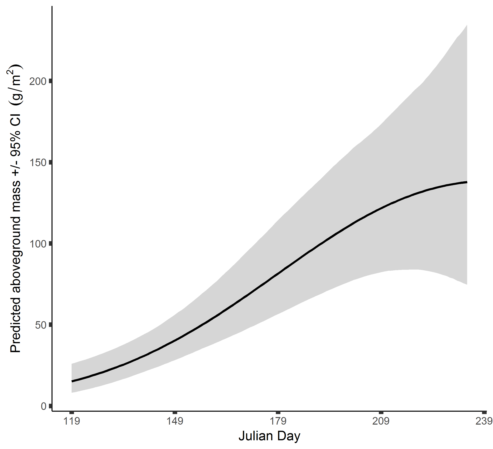
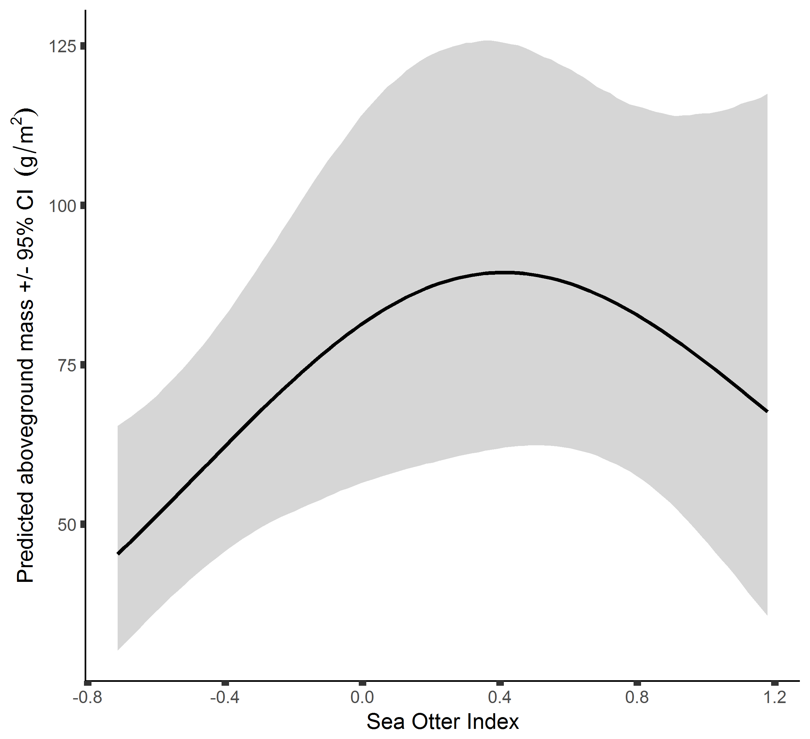
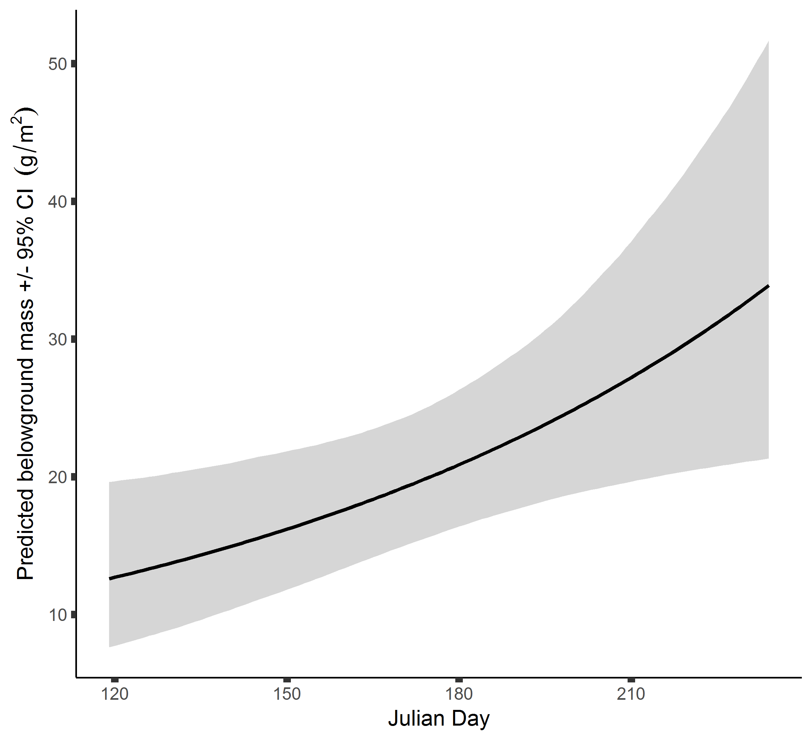
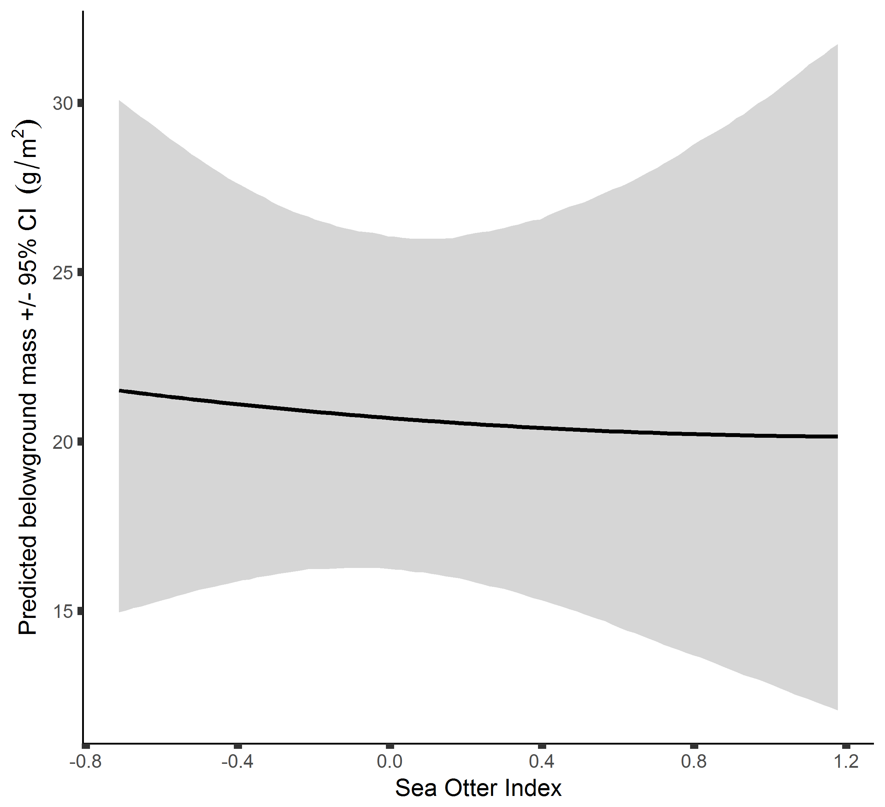

# Summaries from analysis of eelgrass community structure of 2017 data
```{r libraries, echo=FALSE, message=FALSE, warning=FALSE}
library(ggplot2)
library(DT)
library(cowplot)
```

```{r data, echo = FALSE}
mod1.sumstats <- read.csv("EG_Mod1_sumstats.csv", header = TRUE, stringsAsFactors = FALSE)
mod1.WAIC <- read.csv("EG_Mod1_WAIC.csv", header = TRUE, stringsAsFactors = FALSE)
mod1.LOOIC <- read.csv("EG_Mod1_LOOIC.csv", header = TRUE, stringsAsFactors = FALSE)

mod2.sumstats <- read.csv("EG_Mod2_sumstats.csv", header = TRUE, stringsAsFactors = FALSE)
mod2.WAIC <- read.csv("EG_Mod2_WAIC.csv", header = TRUE, stringsAsFactors = FALSE)
mod2.LOOIC <- read.csv("EG_Mod2_LOOIC.csv", header = TRUE, stringsAsFactors = FALSE)

mod3.sumstats <- read.csv("EG_Mod3_sumstats.csv", header = TRUE, stringsAsFactors = FALSE)
mod3.WAIC <- read.csv("EG_Mod3_WAIC.csv", header = TRUE, stringsAsFactors = FALSE)
mod3.LOOIC <- read.csv("EG_Mod3_LOOIC.csv", header = TRUE, stringsAsFactors = FALSE)
```

Model Coefficients and their real meanings
```{r coefs, echo = FALSE}
coefs <- data.frame(Coefs = c("sigS", "sigO", "beta0", "beta1", "beta1b", "beta2", "beta2b", "beta3", "beta4", "beta5"), Names = c("among site", "within site", "intercept", "time", "time^2", "SOI", "SOI^2", "sediment", "light", "grazer load"))

DT::datatable(coefs)
```


## Model 1 - Aboveground biomass
Response - log normally distributed. We hypothesise that time (as julian day), sea otter index, sediment type, and light attenuation may effect aboveground biomass of eelgrass.

Model comparison - WAIC
```{r, echo=FALSE}
DT::datatable(mod1.WAIC, options = list(pageLength = length(mod1.WAIC)))
```

Model comparison - LOOIC
```{r, echo=FALSE}
DT::datatable(mod1.LOOIC, options = list(pageLength = length(mod1.LOOIC)))
```

Best models comparisons
```{r, echo=FALSE}
DT::datatable(mod1.sumstats, options = list(pageLength = length(mod1.sumstats)))

ggplot(mod1.sumstats, aes(color = Model)) +
  geom_hline(yintercept = 0, lty = 2) +
  geom_linerange(aes(Coef, ymin = Lower95, ymax = Upper95), lwd = 1.5, position = position_dodge(width = 1/2)) +
  geom_point(aes(Coef, Median), size = 3, position = position_dodge(width = 1/2)) +
  coord_flip() + 
  scale_y_continuous(breaks = seq(-1.5, 4, by = 0.5)) +
  labs(x = "Coefficient Name", y = " Coefficient Value +/- CI")
```

The best model is 1h, which include quadratic effects of time and SOI.
**Predicted effects - time.**


**Predicted effects - sea otter index.**


## Model 2 - Belowground biomass
Response - log normally distributed. We hypothesise that time (as julian day), sea otter index, sediment type, and light attenuation may effect aboveground biomass of eelgrass.

Model comparison - WAIC
```{r, echo=FALSE}
DT::datatable(mod2.WAIC, options = list(pageLength = length(mod2.WAIC)))
```

Model comparison - LOOIC
```{r, echo=FALSE}
DT::datatable(mod2.LOOIC, options = list(pageLength = length(mod2.LOOIC)))
```

Best models comparisons
```{r, echo=FALSE}
DT::datatable(mod2.sumstats, options = list(pageLength = length(mod2.sumstats)))

ggplot(mod2.sumstats, aes(color = Model)) +
  geom_hline(yintercept = 0, lty = 2) +
  geom_linerange(aes(Coef, ymin = Lower95, ymax = Upper95), lwd = 1.5, position = position_dodge(width = 1/2)) +
  geom_point(aes(Coef, Median), size = 3, position = position_dodge(width = 1/2)) +
  coord_flip() + 
  scale_y_continuous(breaks = seq(-1.5, 4, by = 0.5)) +
  labs(x = "Coefficient Name", y = " Coefficient Value +/- CI")
```

The best model is 1h, which include quadratic effects of time and SOI.
**Predicted effects - time.**


**Predicted effects - sea otter index.**
