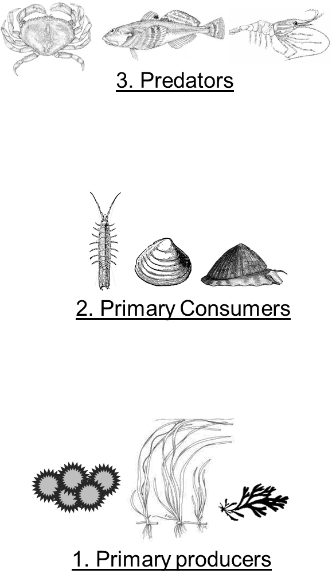

```{r setup, include=FALSE}
knitr::opts_chunk$set(echo = FALSE, warning=FALSE, message=FALSE)
```

# Biomarker collections summary from summer 2018
Here we will take a look at all the tissue samples taken for biomarker analysis from the 2018 field season. From this summary analysis we hope to identify the spatial and treatment coverage of the samples and therefore be able to decide what samples to actually process. 

```{r library, message=FALSE, warning=FALSE, paged.print=FALSE}
library(dplyr)
library(tidyr)
library(DT)
library(ggplot2)
library(leaflet)
```

```{r data, message=FALSE, warning=FALSE}
bio <- read.csv("../../ALL_DATA/Biomarker_collections_2018_RAW.csv", header = TRUE, stringsAsFactors = FALSE) 
```

## Biomarker collections as core eelgrass sites
I collected a lot of samples but some of them are form places other than the core eelgrass sites. Below we will look at only those data and later we look at the other data.

### Eelgrass site tissue samples
```{r eelgrass bm}
bio.eg <- bio %>% 
  filter(Site == "2018_L_01" | Site == "2018_L_02" | Site == "2018_L_03" | Site == "2018_H_01" | Site == "2018_H_02" | Site == "2018_H_03" | Place_name == "Nossuk Bay")

bio.eg.site <- bio.eg %>% 
  group_by(Site, Species_common) %>% 
  summarise(n = n())
```

Map
```{r map}
sites <- unique(bio.eg[, c(2,5,6)])

leaflet(sites) %>% 
  addProviderTiles(providers$Esri.WorldImagery) %>% 
  addMarkers(lng = ~Longitude, lat = ~Latitude, popup = ~ Site)
```

Data
```{r}
datatable(bio.eg.site)
```

An alternative view
```{r}
datatable(spread(bio.eg.site, Species_common, n), extensions = 'FixedColumns',
          options = list(dom = 't', 
                         scrollX = TRUE, 
                         fixedColumns = list(leftColumns = 2)))
```

### Whats the goal here?
The goal is to characterize eelgrass trophic relationships/feeding relationships with SI and FA. To do this we want to have representative samples of the various trophic levels so that we can look for biomarker transfer. Our main hypothesis is that the trophic relationships in AK are similar to CA and the Baltic Sea. What are these trophic levels? Notes that these are rough levels and the lines between them are likely not sharp

1. Primary producers
  + Eelgrass
  + Green algae
  + Brown algae
  + POM
  + Diatoms
  + Microphytobenthos

2. Primary consumers - multiple feeding modes
  + Limpets (direct)
  + Idotea (direct)
  + Butter clam (filter)
  + Cockle (filter)
  + Macoma sp. clam (deposit)
  + Spaghetti worm (deposit)
  
3. Predators
  + Dock shrimp
  + Crabs (Dungy, red rock, Helmet, Kelp)
  + Fishes (Staghorn sculpin, Shiner perch, snake prickleback)
  + Nereid worms



lets group sample by these trophic levels and look again
```{r group by trophic level}
bio.eg$Trophic_level <- ifelse(bio.eg$Species_common == "Eelgrass" | bio.eg$Species_common == "Eelgrass diatoms" | bio.eg$Species_common == "Fucus" | bio.eg$Species_common == "Particulate organic matter" |bio.eg$Species_common == "Ulva" | bio.eg$Species_common == "epiphytic bryozoan" | bio.eg$Species_common == "Microphytobenthos" | bio.eg$Species_common == "Sugar kelp", 1, 
                               ifelse(bio.eg$Species_common == "Butter clam" |bio.eg$Species_common == "Bentnose Macoma" | bio.eg$Species_common == "Cockle" | bio.eg$Species_common == "Idotea" | bio.eg$Species_common == "Limpet" | bio.eg$Species_common == "Pointed Macoma" | bio.eg$Species_common == "Spaghetti worm" | bio.eg$Species_common == "Steamer clam" | bio.eg$Species_common == "Macoma sp." | bio.eg$Species_common == "Sabellid worm", 2, 3))

bio.eg$Trophic_level <- as.factor(bio.eg$Trophic_level)

datatable(bio.eg)
```

Alternative view
```{r}
bio.eg.site.tl <- bio.eg %>% 
  group_by(Site, Species_common, Trophic_level) %>% 
  summarise(n = n())

datatable(bio.eg.site.tl)

bio.eg.site.tl.wide <- spread(bio.eg.site.tl[, c(1,2, 4)], Site, n)
bio.eg.site.tl.wide <- merge(bio.eg.site.tl.wide, bio.eg.site.tl[, 2:3])
bio.eg.site.tl.wide <- unique(bio.eg.site.tl.wide)

datatable(bio.eg.site.tl.wide)
```

### What samples should be processed?
There are many ways to slice this, but here is an option. In parentheses summaries the number of replicates by site. e.g (3 X 6) mean three reps at 6 sites

1. Primary producers
  + Eelgrass (3 X 6) 18
  + Eelgrass diatoms (3 + 2 + 1 + 2 + 1) 9
  + Fucus (3 X 6) 18
  + POM (3 X 5 + 1) 16
  + Sugar kelp (3 X 4 + 1) 13
  + Ulva (3 X 6) 18

2. Primary consumers
  + Limpets (3 X 4 + 2 + 1) 15
  + Idotea (3 X 6) 18
  + Butter clam (3 X 4 + 1 + 1) 14
  + Macoma sp. clam (3 X 5 + 2) 17
  + Spaghetti worm (3 X 4 + 2 + 2) 16
  
3. Predators
  + Dock shrimp (3 X 5) 15
  + Dungeness crab (3 X 3 + 1 + 2 + 2) 14
  + Red rock crab (3 X 3) 9
  + Helmet crab (3 X 4 + 1) 13
  + Snake prickleback (3 X 4 + 2) 14
  + Staghorn sculpin (3 X 6) 18
  + Shiner perch (3 X 6) 18

Total 273 samples! Whoo, that might be to many :/ Maybe there is a way to reduce replication of some of these. For example the marcopytes could be reduced to 2 samples per site so that would remove 18 samples (255)?

## Other data
We are now entering "beyond my dissertation" territory. Over the summer I worked with Tom Bell on collecting spectral reflectance data from a bunch of Macrocystis. From each sampling location I also collected a tissue sample for %N analysis but we could also run SI and FA from it. There may be an opportunity here to relate spectral data to FA content. If we want to do this we should have a larger conversation with Tom. He understands this stuff.

```{r}
macro <- bio %>% 
  filter(Species_common == "Giant Kelp")

datatable(macro)
```


